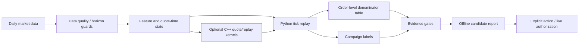

<div align="center">
  <h1>NarrowGate</h1>
  <p>Follow a maker order from submission and queueing to fills, inventory, and PnL.</p>
  <p><a href="README.md">English</a> | <a href="README.zh-CN.md">简体中文</a></p>
</div>

Last materially modified: 2026-09-22

Last materially synchronized: 2026-09-22

> Publication note: `${NARROWGATE_*}` values and deployment-epoch names are logical locators. Owner-side data and machine artifacts are in the private evidence store and are not distributed with this repository unless a repository-relative link is provided. See the [public/private documentation contract](docs/public_private_documentation_contract.md).

NarrowGate is a maker-strategy research framework for studying passive quote selection, inventory campaigns, tick replay, and Python/C++ execution parity. Start with its bundled synthetic replay: no exchange account, API key, market-data download, or C++ build is needed after installation.

[Completed new 13-head research](research/families/f03_causal_13_head/README.md): all 858 strategy-shards completed; Final H=inf −189.212148 USDC versus ML-OFF −269.042233 USDC. Both lost money; this proves neither live profitability nor activation.

## Start Here

**Repository roles:** `xiao-nanbei/NarrowGateMaker-private` is the owner's single development source. `xiao-nanbei/NarrowGateMaker` is its reviewed public source distribution. The public quickstart below targets the latter; authorized private developers clone the former instead. Do not develop divergent implementations in both repositories. See the [current module ownership and remaining migration work](docs/architecture.md).

1. [Install and run the demo](#5-minute-quickstart), then [follow its first order](examples/replay_demo/README.md#follow-the-first-order). You get an event trace and an accounting summary, including an order that never fills.
2. [Bring one day of market data](docs/opensource/one_day_data_pipeline.md). Trades and bars support a limited diagnostic; missing order-book data is reported explicitly rather than presented as an exact queue replay.
3. [Explore the research tools](research/README.md). A closed strategy experiment does not disable the reusable replay or analysis code, and working software is not a claim of trading profitability.

Prefer a browser? The development [Replay Studio](docs/plans/remote_replay_studio.md) runs the same synthetic demo through a durable control service and independent workers. It includes order, inventory and event views, plus a separate read-only importer for completed owner-private B0 results. It does not submit real-market B0 or E/C research. Use the current alpha checkout for this interface.

The source code is publicly available under the [PolyForm Noncommercial License 1.0.0](LICENSE). Because that license limits licensed use to permitted noncommercial purposes, NarrowGate is **source-available**, not open source in the unrestricted-use sense. Commercial use requires separate written permission from the licensor.

It is **not** a packaged trading bot and it does not ship a promoted live parameter set. NarrowGate is primarily a **negative filter**: it is designed to identify conditions in which a maker must not add exposure, rather than to predict the next price direction. When toxicity, volatility, inventory, data quality, or runtime state is unsafe or ambiguous, the default must pause the affected exposure or fail closed. Inward spread compression is an explicit research arm, not a safety default.

The maintained quote core is an **AS-shaped empirical quote controller**, not an exact reproduction or approximate optimum of Avellaneda--Stoikov or GLFT. AS supplies the reservation-price shape; the implemented pair-spread, regime multipliers, depth adapter, and P3 projection are empirical controls. P3 estimates a fixed-horizon, same-side-BBO **touch opportunity** without queue-ahead or touch-to-fill conversion. Its `touch_log_probability_distance_slope` is `-d log(P_touch)/d price_distance`, not a fill hazard or order-arrival intensity. Twice `distance_touch_product_argmax` supplies a symmetric pair-spread floor, not a per-side BBO-distance guarantee or a complete net-profit optimum.

The current quote interface uses **weighted-mid proxy** names and requires explicit `eta_inventory`, `a_spread`, and `risk_per_order` coefficients. Retired quote `gamma`, `kappa`, and spread-multiplier aliases are not accepted. `inventory_reference_qty` defines the inventory normalization; the coefficients do not imply a portable CARA risk-aversion parameter. Clock-window volume imbalance and trade-intensity acceleration remain empirical guards, not reproductions of similarly named published estimators.

The unit-contract migration must preserve final bid/ask, the P3 pair-spread floor, post-only correction, and tick rounding. Conversion of historical configuration belongs to an isolated, one-time migration, not a runtime fallback. It does not change live quotes or establish economic optimality. A finite-order-size/quantity-aware spread, a true per-side same-side-BBO floor, a different risk horizon, and a variance-time cooldown would each change the order or campaign path and require separate research and deployment authorization.

Runtime clocks also have separate roles. UTC rollover resets only daily accounting/statistical state such as the daily PnL baseline and daily fill aggregates. The consecutive-loss state and session marked-equity high-water mark persist across UTC rollover, as do inventory and an open campaign. Execution-book visible-age/source-lag limits cancel or block quotes, while the longer WebSocket silence timeout is a transport reconnect watchdog. Public timeout values are deployment examples, not latency laws for every host.

Fixed base-asset quantity limits and fixed USDC notional, loss, or drawdown limits are independent hard fuses; whichever is stricter binds. They are not one scale-invariant risk coordinate and do not automatically adapt together with equity, BTC price, volatility, fill frequency, or order exposure time. An equity/volatility-aware sizing or risk-budget replacement is itself a strategy/risk candidate and cannot silently replace those hard fuses.

The public repository focuses on the evidence framework:

- predeclared continuous-calendar research with versioned continuous/restart-aware replay; daily fresh-start remains an explicit diagnostic or frozen historical contract;
- order-level denominator tables, not fill-only survivor analysis;
- campaign-level inventory labels such as maximum inventory, duration, maximum adverse excursion (`campaign MAE`), repair, and terminal outcome;
- live/replay mechanism checks under an explicitly frozen data, clock, queue, and initial-state contract before reading PnL;
- optional C++ acceleration for parity-tested hot loops and fast screening.

Terminology: `campaign MAE` always means Maximum Adverse Excursion. Only `prediction MAE` or `model MAE` means Mean Absolute Error. The two metrics must not be mixed.

Evidence labels are deliberately separate. **Causal** describes the feature/clock and estimand contract; **exact** describes a byte or identity match; **formal** describes a frozen, fail-closed procedure; **parity** means two implementations agree under named assumptions; and **authority** is an explicit permission. None of those labels by itself establishes public reproducibility, owner-private reproducibility, economic validity, or permission to trade.

A SHA only establishes that the bytes read now match the bytes named by that digest. It does not establish that data are correct, a configuration is sensible, research is leakage-free, a strategy has economic value, or a live process, order-ownership latch, and exchange reconciliation remain healthy. Those claims require separate validation and runtime checks.

When owner-side evidence refers to BUY E3 or the SELL owner cooldown, those labels mean **owner-authorized live risk experiments**, not strategies that passed the research hard gates. They are not validated optima, and this public repository does not assert whether either experiment is currently active.

Generic deployment code and provider examples are public. Only a concrete host, account, credential, active config/release, runtime receipt, rollback selector, and current operational state are owner-private. Public prose and placeholders never grant remote-control authority; resolve a specific deployment only through ignored private configuration and evidence, and fail closed when that authority is unavailable.

## Current Alpha Version

The owner consolidated history and removed existing tags on 2026-09-13. Public and private `main` now maintain one mutable root commit named `version-alpha-20260913`; subsequent updates amend it until the owner declares the version stable. This is not a stable release. Python and C++ package metadata remain `0.1.2.dev0`, which does not uniquely identify an alpha revision. Start from `main` and record the exact commit/tree for any run:

```bash
git clone --branch main --depth 1 https://github.com/xiao-nanbei/NarrowGateMaker.git narrowgate
```

Old tag names in dated research documents are historical references, not currently downloadable releases. The history rewrite does not rerun experiments or bind old results to this alpha. Owner-side data and runtime authority are not included. See [Source, Research, and Execution Identities](docs/opensource/identity_and_release.md).

## TL;DR

NarrowGate tries to make wrong maker conclusions harder to pass.

1. A maker fill is not automatically spread income; it may be toxic flow.
2. Cross-market/reference data is useful as a moderator or risk label, but a global `multi_market.enabled` switch is not alpha.
3. Queue ahead, latency, fill gates, cooldown, TTL, and campaign state can change bar-backtest conclusions.
4. C++ is used where the boundary is stable: quote math, tick replay pieces, signal state, and compact live hot-path experiments. Python remains the research and evidence layer.

> **2026-07-15 replay integrity notice:** legacy 10-second ML artifacts exposed left-labelled feature buckets 10 seconds early in tick replay. Formal replay now requires bucket-end metadata and causal warmup; all legacy model bundles must be retrained before they can support promotion. Formal replay also uses a merged trade/BBO/L2/100ms timer clock so lifecycle state no longer waits for the next execution trade. See [the repair note](research/system_engineering/docs/replay_time_unit_causality_repair_20260715.md).
>
> **Historical event-L2 boundary:** Earlier multi-source studies used a different input contract. Their data tiers and results are historical, not current defaults or exact deep-queue truth. See [the historical row-level validation](docs/retained_event_l2_rebuild_20260718.md); use the current [data guide](data/README.md) for new input work.

## Market Data

The current historical input layer is `data`: a fixed 407-day calendar (2025-08-01..2026-09-11), BTCUSDC perpetual execution and BTCUSDT perpetual reference, with purchased L2 and trades. Acquisition is configured privately; public operation does not select a supplier or disclose delivery endpoints. Raw purchases are retained separately from derived facts, observations, Bars and features. See the [current data guide](data/README.md) for commands and actual implementation limits.

Live transport remains a separate adapter and is not changed by the historical input migration. Field/statistical contract parity does not restore native packet timing or exact order queues. Historical external-venue and mixed-source studies retain their original identities and limitations; they are not current data defaults or permission to enable collection.

## 5-Minute Quickstart

NarrowGate requires Python 3.11 or newer; the executable does not need to be named `python3.11`. Check the interpreter already on your machine first:

```bash
python3 --version
```

If that command exists and reports Python 3.11 or newer, use `PYTHON=python3`. If it is missing or older, install a supported interpreter before creating the virtual environment:

| Platform | Installation entry point | Interpreter for the commands below |
| --- | --- | --- |
| macOS with [Homebrew](https://brew.sh/) | `brew install python@3.11` | `PYTHON="$(brew --prefix python@3.11)/bin/python3.11"` |
| Ubuntu 24.04+ or Debian 12+ | `sudo apt-get update && sudo apt-get install -y python3 python3-venv` | `PYTHON=python3` |
| Other or older Linux distributions | Follow the official [pyenv installation guide](https://github.com/pyenv/pyenv#installation), then run `pyenv install 3.11 && pyenv local 3.11` | `PYTHON="$(pyenv which python)"` |

The [Python downloads page](https://www.python.org/downloads/) is the fallback for macOS without Homebrew; after using its installer, set `PYTHON=python3`. Verify the selected interpreter before continuing:

```bash
"$PYTHON" -c 'import sys; assert sys.version_info >= (3, 11), sys.version'
```

Choose one installation target. Extras are additive to the base package:

| Use case | Install command inside the virtual environment | What it installs |
| --- | --- | --- |
| Demo | `python -m pip install -e .` | Base NumPy/Pandas/PyYAML dependencies, the CLI, and no-data examples |
| Public data acquisition | `python -m pip install -e ".[data]"` | Demo dependencies plus Parquet, HTTP archive, and zstd tooling for public download/normalization commands |
| Research | `python -m pip install -e ".[research]"` | Demo dependencies plus Parquet, scientific, ML, and compressed-data tooling |
| Live integration | `python -m pip install -e ".[live]"` | Demo dependencies plus public REST/WebSocket connector libraries; the tracked live config remains a non-deployable template |
| All / contributor | `python -m pip install -e ".[all]"` | Research and live dependencies plus pytest and Ruff for the complete public test suite |

The `dev` extra contains only pytest and Ruff. Combine it explicitly with another target when needed, or use `all` for contributor work. Current acquisition uses `.[data]` and a private delivery configuration. Legacy optional adapter extras remain for historical compatibility, outside `all`; they are not required or selected by the current data layer. Installing software does not grant a data license or research eligibility.

[`requirements.txt`](requirements.txt) is a legacy runtime/adapter compatibility superset; it intentionally excludes pytest and Ruff. New source checkouts should use the narrower extras above so a demo, data, research or live-integration environment receives only its selected dependencies. It is generated from `pyproject.toml`, not maintained separately. After dependency edits, run `.venv/bin/python scripts/export_compat_requirements.py > requirements.txt`; verify with `--check`. It installs dependencies only, not this source package.

The default quickstart is the data-free **Demo** target:

```bash
git clone https://github.com/xiao-nanbei/NarrowGateMaker.git narrowgate
cd narrowgate

PYTHON="${PYTHON:-python3}"
"$PYTHON" -c 'import sys; assert sys.version_info >= (3, 11), sys.version'
"$PYTHON" -m venv .venv
source .venv/bin/activate
python -m pip install --upgrade pip
python -m pip install -e .

narrowgate doctor
narrowgate replay-demo --output-dir results/replay_demo --verify-reference
```

Expected result:

- `narrowgate doctor` prints dependency and path status; optional research/C++ dependencies may report `false` in a Demo installation.
- `replay-demo` writes `summary.json`, `trace.jsonl`, and `receipt.json` under `results/replay_demo`; `--verify-reference` checks the bundled expected output.
- The fixture submits three orders: two fill, one is canceled unfilled, and inventory returns to zero. Its synthetic PnL illustrates accounting, not expected strategy returns. See the [step-by-step explanation](examples/replay_demo/README.md).

Optional small checks, also without exchange access or private data:

```bash
narrowgate quote-demo
python examples/order_level_score_demo.py
python -m unittest discover -s tests -p 'test_public_onboarding.py' -v
```

For the optional C++ extension:

```bash
python -m pip install -e cpp
python -c "import narrowgate_cpp; print(narrowgate_cpp.__file__)"
```

The local demo above remains the five-minute entry point. To deploy the public code on a separately provisioned AWS EC2 instance, follow the placeholder-only [generic deployment flow and AWS EC2 example](docs/ops/README.md). That guide and the deployment kernel are public; the target address, credentials, active config, artifacts, hashes, release identity, and receipts must be supplied privately by the operator.

## Offline Checks And Their Limits

The replay demo checks its synthetic queue, lifecycle, and accounting against published reference files. It does not simulate measured network latency or reconstruct an exchange's hidden order queue. The separate `bash live/run.sh dry-run` checks live inputs and exits before creating a network client, thread, engine, or order path; it does not start trading. See [Live / Dry-Run Boundary](docs/ops/live_dry_run.md). Neither check certifies a profitable strategy or a deployment.

## Participate

Start with [source-available project navigation](docs/opensource/README.md), follow [Contributing](CONTRIBUTING.md) for ordinary and research changes, and use the [Security policy](SECURITY.md) for vulnerabilities. The [one-day data pipeline](docs/opensource/one_day_data_pipeline.md) shows the honest boundary between public trade archives, optional authenticated L2, diagnostic replay, and formal evidence. Maintainers should configure the exact required checks documented under [Branch protection](docs/dev/ci.md#branch-protection).

## What This Repo Is For

NarrowGate is useful if you want to inspect or reuse:

- a market-making evidence workflow;
- tick replay and implementation-parity ideas under frozen replay/live assumptions;
- order-level and campaign-level labels;
- data-quality and horizon/gap guards;
- Python/C++ boundary design for low-latency research systems.

It is not designed as a one-command profitable strategy. Public configs are templates, and private live parameters/results are intentionally not included.

## Research Map and Long-Form Articles

Use the [NarrowGate Research Project Map: 12 Scientific Questions](https://xiao-nanbei.github.io/2026/08/29/NarrowGate-Research-Project-Map/) as the current entry point. It consolidates the repository into 12 scientific questions and links each question to its long-form study, evidence status, and family workspace. The two earlier notes below remain foundation and engineering background rather than a complete research index:

- [NarrowGate: Maker Quote EV Research Framework](https://xiao-nanbei.github.io/2026/06/19/NarrowGate-Maker-Quote-EV-Research-Framework/) covers the maker alpha/evidence side: data quality, daily replay, quote EV, null baselines, order-level fill selection, campaign labels, and why old direct xmarket/quote-EV arms were downgraded.
- [NarrowGate: Replay Throughput and Live Tail-Latency Engineering](https://xiao-nanbei.github.io/2026/07/01/NarrowGate-Cpp-Low-Latency-Market-Making/) covers the system side: Python/C++ parity, replay acceleration, compact live hot-path design, x86 soak results, and which C++ paths are suitable only for fast screening.

## Architecture



## Repository Map

| Path | Purpose |
| --- | --- |
| `narrowgate/` | Stable public CLI facade |
| `strategy/` | Quote core, maker engine, signal/inventory logic |
| `models/`, `models/audit/` | Stable import/CLI ABI plus shared replay and governance infrastructure |
| `research/` | Ten family workspaces, shared contracts, system-engineering evidence, and versioned path governance; see [research map](research/README.md) |
| `data/`, `features/` | Offline download/import/normalization code and feature engineering; data files live outside the checkout |
| `live/orderbook/` | Live execution-market public-book reconstruction; no historical payload storage |
| `execution/` | State attached to NarrowGate's own active orders and queue paths |
| `cpp/` | Optional pybind11/C++ acceleration module |
| `examples/` | No-data examples for new users |
| `docs/` | Cross-family market-data, Feature-DAG, scorecard, cache, path, and repository-governance documentation; family-owned evidence lives under `research/families/*/docs/` |
| `docs/ops/` | Dry-run and deployment guardrails |
| `docs/dev/` | Development, CI, and C++ build notes |
| `docs/private/` | Ignored local notes; never publish |

The long-form design log remains in [project.md](project.md). It is intentionally more detailed than this README.

Historical family-owned paths under `models/`, `models/audit/`, `features/`, `docs/`, selected `cpp/narrowgate_cpp/` locations, and the former root `research_*` directories have been removed. Active code imports canonical `research.families.*` packages. Versioned maps and exact migration-boundary bytes live under `research/governance/` for historical manifest verification.

## Data Layout

The `data/` package contains code, not licensed market payloads. Configure real raw and derived roots through `data_paths.py`; do not create supplier aliases or symlinks. Purchased compressed originals remain raw even inside an incoming delivery directory. Shared fact bundles, observations, trade flow, Bars and features belong in derived storage. Cache and temporary conversion copies are disposable only after confirming no running owner or unique evidence dependency.

The explicit `NARROWGATE_CACHE_ROOT` override wins; otherwise the portable cache default is `$XDG_CACHE_HOME/NarrowGate_BTCUSDC`, falling back to `$HOME/.cache/NarrowGate_BTCUSDC` when XDG is unset. Raw inputs, canonical data and frozen evidence never inherit cache deletion authority. See [Path Conventions](docs/path_conventions.md) for root variables and private evidence ownership.

Use `.venv/bin/python -m data --help` (also `narrowgate data` or `pipeline.py data`). The [data guide](data/README.md) supersedes the retired 401-day mixed-source layout and implicit downloader defaults. All 407 dates remain in inventory, including missing files and uncertain observations. Data repair does not reset previous-use, unseal evidence, complete funding or authorize model/economic/live activation.

Historical source-specific command examples are not current operations. They remain explicitly available through `pipeline.py legacy <command>` and their owning research documents for mechanism reference, without automatic source fallback or rebinding old results to the new data.

## Public vs Private Config

The tracked [live/config.yaml](live/config.yaml) is a **public template**. It is safe to load but is not a live parameter snapshot.

Private runtime configs should be ignored locally:

```bash
export NARROWGATE_LIVE_CONFIG="$PWD/docs/private/live_config.current.local.yaml"
bash live/run.sh start
```

`make deploy-preflight` rejects a config marked `PUBLIC TEMPLATE` and admits only a hash-bound model bundle whose heads and bundle manifest explicitly authorize live use. Public synthetic, `public_dry_run_only`, `research_only`, missing-authority, and `authority.live=false` artifacts therefore fail closed during local admission. The separate `make publish-source-dry` and `make publish-source` targets transfer only a clean public Git checkout; they do not read private deployment inputs or start a process. Controlled activation of a prepared release uses `python3.12 scripts/live_deploy_common.py activate-prepared-release --help`; it defaults to dry-run, executes one remote transaction only with `--execute`, and never automatically restarts the old release on failure. Normal activation accepts a verified running transient `narrowgate.service`; persistent or ambiguous process ownership fails before stop. The explicit `--resume-stopped` recovery is restricted to an already quiescent prior activation attempt whose current pointer still names the previous release and whose reconciliation/activation outputs do not exist. A selected release that later exits 78 uses the separate `--recover-runtime-fatal` path, which proves its prior activation, fail-closed runtime health, authentic systemd exit, and process quiescence before creating fresh reconciliation and activation evidence. The preflight also prints the effective P3 artifact identity. A nonzero `p3_kappa_eff_override` is a legacy replay/config field and is unconditionally rejected by current deploy preflight and runtime; no environment-variable trial unlock exists.

### Persisted live runtime profiles

`live/run.sh` loads Binance execution credentials from the untracked `live/.env`, then loads a non-secret compute profile from `live/profiles/`. This prevents native flags from silently disappearing after a config or code restart:

```bash
# Inspect exactly what the next start will persist.
NARROWGATE_LIVE_PROFILE=native bash live/run.sh profile

# Controlled Python implementation window using the same config/thread limits.
NARROWGATE_LIVE_PROFILE=python bash live/run.sh restart

# Strict native quote/signal/routing window.
NARROWGATE_LIVE_PROFILE=native bash live/run.sh restart
```

Startup logs include the profile name, every `NARROWGATE_CPP_*` flag, and the loaded extension path. Strict native mode exits on a missing module/API instead of silently measuring Python fallback.

The native profile also enables `NARROWGATE_CPP_GLOBAL_FLOW=1`. External venue trade frames enter one fixed-array native batch and update cross-market bars with one lock acquisition; it does not create dispatcher workers or activate a quote policy. HEALTH exposes accepted/stale/out-of-order/overflow counters, and strict startup requires the batch ABI. Reproduce the isolated target-host benchmark with:

```bash
python bench/bench_global_flow_batch.py \
  --frames 1000 --frame-sizes 1 8 32 --rounds 5
```

The host-specific soak record is owner-private and is not distributed with the public repository; this section retains only the portable parity and preflight boundary.

Normal quote REST remains synchronous. The experimental async gateway was removed after a 194-minute target-host soak showed worse requote and order-update tails with almost no useful coalescing. The soak report remains in `project.md`; there is no dormant runtime switch or telemetry ABI to maintain.

Comparable soak windows use line-number markers so warmup/restart rows are not mixed into the report:

```bash
python scripts/analyze_live_soak.py mark \
  --profile native-sync \
  --output logs/soak/native-sync.marker.json

python scripts/analyze_live_soak.py report \
  --marker logs/soak/native-sync.marker.json \
  --output-json logs/soak/native-sync.json \
  --output-md logs/soak/native-sync.md

python scripts/analyze_live_soak.py compare \
  --baseline logs/soak/native-sync.json \
  --candidate logs/soak/native-async.json
```

The mainnet A/B orchestrator requires the explicit `ACK_LIVE_SOAK=YES` guard and only manages the process through `live/run.sh`.

## Common Commands

```bash
# Environment/path check
narrowgate doctor
narrowgate paths

# No-data demos
narrowgate quote-demo
python examples/order_level_score_demo.py

# Parameter coverage / racing smoke
python research/families/f01_fixed_parameter_racing/parameter_racing_sweep.py \
  --symbol BTCUSDC \
  --tag public_quick \
  --stage quick-smoke \
  --groups spread guard cooldown execution

# Unified audit runner entrypoint
python -m research.families.f10_live_replay_attribution.audit.runner --help

# Side-specific exposure-increasing campaign-tail calibration
python -m research.families.f09_campaign_action_uplift.audit.campaign_tail_score --help

# Action-level policy learning / counterfactual evaluation
python -m research.families.f09_campaign_action_uplift.audit.offline_policy_evaluation --help
```

The offline evaluator requires a complete decision/action panel, estimates behavior propensities and action-specific outcomes out of fold, and reports DM/IPS/SNIPS/doubly-robust values together with overlap and effective-sample-size gates. A placed-order or filled-only score table is deliberately rejected as a substitute for actions the baseline never attempted. See [the OPE contract](research/families/f09_campaign_action_uplift/docs/offline_policy_evaluation_20260712.md).

The next-generation strategy boundary is implemented as a bounded, state-conditioned action layer rather than another global parameter sweep. Fixed quote parameters remain the safety envelope; a frozen artifact may choose only baseline, prevent-over-widen, widen one tick, or re-center one tick on the exposure-increasing add surface. Python replay and the governed runtime use the same action geometry, unsupported C++ runs fail fast, and a private deployment must independently authorize any artifact. Public action evidence is recorded in [the side-specific randomized audit](research/families/f09_campaign_action_uplift/docs/side_specific_action_uplift_existing_split_20260718.md), [the BUY conditional-widen audit](research/families/f09_campaign_action_uplift/docs/buy_add_conditional_widen_causal_v4_v1_20260718.md), [the SELL competing-risk audit](research/families/f09_campaign_action_uplift/docs/sell_add_repair_trend_skip_causal_v4_v1_20260718.md), [the queue keep/cancel v1 audit](research/families/f07_active_order_continuation/docs/queue_value_keep_cancel_v1_20260719.md), [the corrected cancel/re-enter v3 Development audit](research/families/f07_active_order_continuation/docs/queue_value_cancel_reenter_v3_development_20260720.md), and [the deep active-order queue probe](research/families/f07_active_order_continuation/docs/deep_active_order_queue_probe_20260720.md). The deep probe preserves v3's no-promotion decision but supersedes its queue mechanism interpretation: top-20 fallback changed queue seeds, fills, and the entire inventory path. A new queue action family requires strict active-price queue state with no formal fallback. The watch-specific sparse replay failed its g0-g3 fixed-point closure gate, so the next engine must consume native snapshot/delta state independently of the strategy trajectory.

Real replay/training commands consume prepared inputs under `MM_DATA_ROOT` for a predeclared continuous calendar, with missing/aged intervals explicitly represented rather than silently dropping their dates. Strict book/queue studies still require inputs that support their declared mechanism. The [current training plan](research/families/f05_fill_quality_quote_ev/docs/risk_selection_scope.md#continuous-data-and-training-plan) requires at least three consecutive months of effectively supported training data and later independent OOT evidence, subject to previous use; a calendar span or a few diagnostic labels does not establish that support. Each comparison arm independently carries its complete state across dates, with causal warmup and label-outcome boundaries specified separately.

## Testing and CI

Install the `all` target before running the complete public suite. Local checks:

```bash
python -m pytest -q
python -m ruff check narrowgate examples data_paths.py data/audit_raw_trades.py
```

GitHub Actions runs:

- Python install + CLI smoke;
- lint on the public surface;
- pytest;
- optional C++ extension build/import smoke.

See [docs/dev/ci.md](docs/dev/ci.md).

## Docker / Devcontainer

```bash
# Base Demo image.
docker build -t narrowgate .
docker run --rm narrowgate

# Optional image matching another installation-matrix row.
docker build \
  --build-arg NARROWGATE_INSTALL_TARGET='.[research]' \
  -t narrowgate-research .
```

VS Code users can open the repository in the included devcontainer. It builds the `all` target, rebinds the editable install to the mounted checkout without downloading dependencies again, and keeps market data and caches on named volumes outside the source tree.

## Research Workflow

Promotion evidence follows this order:

```text
data quality
  -> replay/live mechanism alignment
  -> fill selection sanity
  -> OOS bucket / score stability
  -> daily campaign and inventory gates
  -> frozen offline candidate decision
  -> explicit action and live authorization
```

Bucket hits alone are diagnostic. A candidate must preserve mechanism metrics, side split, campaign risk, tail days, and inventory-time behavior before PnL is treated as meaningful.

### Formal Replay Integrity

For private retained-data research, `research/families/f01_fixed_parameter_racing/campaign_outcome_replay_audit.py` also provides two implementation diagnostics:

- `--integrity-diagnostic-arms` compares historical/off/sign-corrected markout feedback and compress/pause/observe spread-cap actions;
- `--random-passive-trials N` runs an executable passive null through the full queue, latency, cooldown, inventory, campaign, and terminal-accounting state machine.

Use `--strict-calibration` with an explicit private config. Formal replay then fails fast when the identity-bound P3 touch-slope adapter, queue calibration, historical BBO/L2, or order-latency calibration is missing. This does not relabel P3 as fill probability or arrival intensity. The executable null is not a deployable strategy: its report compares activity, spread/action mix, side split, inventory time, tails, markout, and PnL per fill so path-dependent changes in fill count cannot masquerade as alpha. See [docs/audit_entrypoints_20260630.md](docs/audit_entrypoints_20260630.md).

Replay window end is a mark-to-market boundary, not an implicit taker close. `final PnL = cash + inventory * terminal mark`; the hypothetical taker-close cost is reported separately as `terminal_liquidation_fee_estimate` and is not deducted. The current BTCUSDC research config uses `maker_fee=0`; taker fees apply only to explicit taker exits such as timeout or emergency liquidation.

## Disclaimer

Crypto trading can involve legal, compliance, operational, and financial risk. This repository is for C++ systems research, market microstructure study, backtesting methodology, and technical education. It is not financial advice and does not recommend or solicit trading.

## License

NarrowGate is source-available under the [PolyForm Noncommercial License 1.0.0](LICENSE). The license permits the noncommercial purposes stated in its terms and restricts commercial use; it is therefore not presented as an unrestricted-use open-source license. Commercial use requires separate written permission from the licensor.
