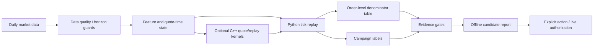

<div align="center">
  <h1>NarrowGate</h1>
  <p>Maker-strategy research, causal replay, and implementation parity under stated assumptions.</p>
  <p><a href="README.md">English</a> | <a href="README.zh-CN.md">简体中文</a></p>
</div>

Last materially modified: 2026-08-30

Last materially synchronized: 2026-08-30

> Publication note: `${NARROWGATE_*}` values and deployment-epoch names are logical locators. Owner-side data and machine artifacts are in the private evidence store and are not distributed with this repository unless a repository-relative link is provided. See the [public/private documentation contract](docs/public_private_documentation_contract.md).

NarrowGate is a maker-strategy research framework for studying passive quote selection, inventory campaigns, tick replay, and Python/C++ execution parity.

The source code is publicly available under the [PolyForm Noncommercial License 1.0.0](LICENSE). Because that license limits licensed use to permitted noncommercial purposes, NarrowGate is **source-available**, not open source in the unrestricted-use sense. Commercial use requires separate written permission from the licensor.

It is **not** a packaged trading bot and it does not ship a promoted live parameter set. NarrowGate is primarily a **negative filter**: it is designed to identify conditions in which a maker must not add exposure, rather than to predict the next price direction. When toxicity, volatility, inventory, data quality, or runtime state is unsafe or ambiguous, the default must pause the affected exposure or fail closed. Inward spread compression is an explicit research arm, not a safety default.

The maintained quote core is an **AS-shaped empirical quote controller**, not an exact reproduction or approximate optimum of Avellaneda--Stoikov or GLFT. AS supplies the reservation-price shape; the implemented pair-spread, regime multipliers, depth adapter, and P3 adapter are empirical controls. In particular, P3 estimates a fixed-horizon, same-side-BBO **touch opportunity** without queue-ahead or touch-to-fill conversion. Its legacy local `-d log(P_touch)/d distance` adapter is neither a fill hazard nor the AS/GLFT order-arrival `kappa`, and the frozen `2 * delta_star` mechanism is only a symmetric pair-spread floor, not a per-side BBO-distance guarantee.

Legacy public field names remain stable for replay, model, JSON, and C++ ABI compatibility. In current prose, `microprice` means a top-N-size **weighted-mid proxy**, clock-window `vpin_*` means **clock-volume imbalance**, and `ber_*` means a **trade-intensity-burst guard**. Those names do not claim reproduction of the corresponding published estimators. Likewise, `gamma` is a compatibility input: `q_ref`, order quantity `z`, `eta_inventory`, and `a_spread` expose the implemented units, while omitted new coefficients reproduce the frozen B0 numbers rather than deriving a portable CARA risk-aversion parameter.

That unit-contract split is a behavior-preserving B0 migration: with the legacy mapping, final bid/ask, the historical P3 pair-spread floor, post-only correction, and tick rounding must remain identical. It does not change a live quote or establish that the mapped coefficients are economically optimal. A finite-order-size/quantity-aware spread, a true per-side same-side-BBO floor, an H5/H10 risk horizon, and a variance-time cooldown would each change the order or campaign path. They are separate research candidates with no economic, action, or live authority.

Runtime clocks also have separate roles. UTC rollover resets only daily accounting/statistical state such as the daily PnL baseline and daily fill aggregates. The consecutive-loss state and session marked-equity high-water mark persist across UTC rollover, as do inventory and an open campaign. Execution-book visible-age/source-lag limits cancel or block quotes, while the longer WebSocket silence timeout is a transport reconnect watchdog. Public timeout values are deployment examples, not latency laws for every host.

Fixed base-asset quantity limits and fixed USDC notional, loss, or drawdown limits are independent hard fuses; whichever is stricter binds. They are not one scale-invariant risk coordinate and do not automatically adapt together with equity, BTC price, volatility, fill frequency, or order exposure time. An equity/volatility-aware sizing or risk-budget replacement is itself a strategy/risk candidate and cannot silently replace those hard fuses.

The public repository focuses on the evidence framework:

- identity-bound daily fresh-start or versioned continuous/restart-aware replay;
- order-level denominator tables, not fill-only survivor analysis;
- campaign-level inventory labels such as maximum inventory, duration, maximum adverse excursion (`campaign MAE`), repair, and terminal outcome;
- live/replay mechanism checks under an explicitly frozen data, clock, queue, and initial-state contract before reading PnL;
- optional C++ acceleration for parity-tested hot loops and fast screening.

Terminology: `campaign MAE` always means Maximum Adverse Excursion. Only `prediction MAE` or `model MAE` means Mean Absolute Error. The two metrics must not be mixed.

Evidence labels are deliberately separate. **Causal** describes the feature/clock and estimand contract; **exact** describes a byte or identity match; **formal** describes a frozen, fail-closed procedure; **parity** means two implementations agree under named assumptions; and **authority** is an explicit permission. None of those labels by itself establishes public reproducibility, owner-private reproducibility, economic validity, or permission to trade.

A SHA only establishes that the bytes read now match the bytes named by that digest. It does not establish that data are correct, a configuration is sensible, research is leakage-free, a strategy has economic value, or a live process, order-ownership latch, and exchange reconciliation remain healthy. Those claims require separate validation and runtime checks.

When owner-side evidence refers to BUY E3 or the SELL owner cooldown, those labels mean **owner-authorized live risk experiments**, not strategies that passed the research hard gates. They are not validated optima, and this public repository does not assert whether either experiment is currently active.

Generic deployment code and provider examples are public. Only a concrete host, account, credential, active config/release, runtime receipt, rollback selector, and current operational state are owner-private. Public prose and placeholders never grant remote-control authority; resolve a specific deployment only through ignored private configuration and evidence, and fail closed when that authority is unavailable.

## Stable Public Release

The supported public software snapshot remains the annotated Git tag `v0.1.1`, whose tagged tree carries package version `0.1.1`. The current `main` development line intentionally reports `0.1.2.dev0` for both Python and C++ distribution metadata; it is not the `v0.1.1` release and must not produce another `0.1.1` wheel. Pin the release tag when reproducibility matters:

```bash
git clone --branch v0.1.1 --depth 1 https://github.com/xiao-nanbei/NarrowGateMaker.git narrowgate
```

Research reconstruction and execution-attempt tags are evidence identities, not software releases. A release tag does not include owner-side data, grant research or live authority, or certify the economics of any private artifact. See [Source, Research, and Execution Identities](docs/opensource/identity_and_release.md).

## TL;DR

NarrowGate tries to make wrong maker conclusions harder to pass.

1. A maker fill is not automatically spread income; it may be toxic flow.
2. Cross-market/reference data is useful as a moderator or risk label, but a global `multi_market.enabled` switch is not alpha.
3. Queue ahead, latency, fill gates, cooldown, TTL, and campaign state can change bar-backtest conclusions.
4. C++ is used where the boundary is stable: quote math, tick replay pieces, signal state, and compact live hot-path experiments. Python remains the research and evidence layer.

> **2026-07-15 replay integrity notice:** legacy 10-second ML artifacts exposed left-labelled feature buckets 10 seconds early in tick replay. Formal replay now requires bucket-end metadata and causal warmup; all legacy model bundles must be retrained before they can support promotion. Formal replay also uses a merged trade/BBO/L2/100ms timer clock so lifecycle state no longer waits for the next execution trade. See [the repair note](research/system_engineering/docs/replay_time_unit_causality_repair_20260715.md).
>
> **Historical event-L2 boundary:** Binance individual `trades` preserve matching events but do not reveal cancel/refill. Retained sub-second/100ms book-path studies therefore combine individual trades with CryptoHFTData price-level deltas. Native-snapshot reconstruction remains the strict tier; explicitly labelled `delta-converged` top-20 data is a separate research tier and is never treated as exact deep-queue truth. See [the market-data guide](docs/market_data.md#retained-event-l2-rebuild) and [the row-level validation](docs/retained_event_l2_rebuild_20260718.md).

## Market Data Sources

Market identity is always `venue:instrument:symbol`; feeds with the same display symbol are not merged before an explicit consensus or conversion step. The table describes implemented paths, not a claim that every optional source is enabled in production. The tracked public template keeps `multi_market`, all external venues, and the independent deep book disabled.

| Layer | Venue | Instrument / symbol | Transport or archive data | Purpose | Can place orders? | Availability in the public template |
| --- | --- | --- | --- | --- | --- | --- |
| Execution | Binance USD-M | `BTCUSDC` perpetual | Live `aggTrade`, top-20 partial depth at 100ms, and `bookTicker`; private user stream; optional REST snapshot + 100ms diff-depth book | Quoting, fills, inventory, execution BBO/L2, and optional active-order queue/path state | **Yes**, through the Binance USD-M REST order API | Core path; template uses testnet. Independent deep book is implemented but off by default |
| Binance reference | Binance USD-M | `BTCUSDT` perpetual | Live `aggTrade` and `bookTicker`; historical official individual-trade 1s bars | Cross-symbol price/flow reference and causal historical local bridge; never an execution route in this repository | No | Implemented behind `multi_market`; off by default |
| Binance reference | Binance spot | `BTCUSDC` and `BTCUSDT` | Live `bookTicker` and `aggTrade` | Spot anchors, cross-checks, and cross-instrument features | No | Only in `enhanced`/`full` multi-market stages; off by default |
| Binance reference | Binance spot | `USDCUSDT` | Live `bookTicker` only | Stablecoin conversion anchor for `BTCUSDT / USDCUSDT -> BTCUSDC` | No | Only in `enhanced`/`full` multi-market stages; off by default |
| Cross-venue reference (inactive) | Bitget | `BTCUSDT` perpetual and spot | Public v3 WebSocket `books1` + `publicTrade` | Historical/offline reference, flow, and toxicity evidence | No | Read-only adapter retained but inactive; not part of current collection |
| Cross-venue reference (inactive) | Bybit | `BTCUSDT` linear perpetual and spot | Public v5 WebSocket `orderbook.1` + `publicTrade` | Historical/offline reference, flow, and toxicity evidence | No | Read-only adapter retained but inactive; not part of current collection |
| Cross-venue reference (inactive) | OKX | `BTC-USDT-SWAP` and `BTC-USDT` spot | Public WebSocket `bbo-tbt` + `trades` | Historical/offline reference, flow, and toxicity evidence | No | Read-only adapter retained but inactive; not part of current collection |
| Historical archive | Binance Vision | USD-M `BTCUSDC` / `BTCUSDT`; configured spot symbols | Daily `aggTrades`; USD-M individual `trades` and `metrics` | Retained-day replay inputs, matching-event trades, bars, and metrics; **not historical L2** | No | On-demand downloader; not a live daemon |
| Historical archive | CryptoHFTData | Binance Futures `BTCUSDC` execution market | Third-party hourly price-level snapshot/delta `.parquet.zst`, normalized to daily BBO/top-20 L2 at 100ms | Historical execution-book path and queue research; eligibility requires strict coverage and sequence audits | No | Authenticated, incomplete third-party source; downloaded only on demand |
| Historical archive | Tardis delivery | Binance Futures `BTCUSDC` execution market | Daily `incremental_book_L2` and native `book_ticker` `.csv.zst` | Source-separated candidate for repairing CryptoHFTData-missing dates; requires independent bootstrap, timestamp, BBO, coverage, and gap admission | No | Resumable downloader implemented; never relabelled as CryptoHFTData and not policy-eligible on download alone |
| Historical archive | Bitget | `BTCUSDT` perpetual and spot | Perpetual: recent public fills REST; perpetual/spot: official retained archive import | UTC-normalized trade history and causal 1s reference features | No | On-demand; archive required outside the recent REST window |
| Historical archive | Bybit | `BTCUSDT` perpetual and spot | Public daily trade archives | UTC-normalized trade history and causal 1s reference features | No | On-demand retained-day downloader |
| Historical archive | OKX | `BTC-USDT-SWAP` and `BTC-USDT` spot | UTC+8 daily history ZIP download/import, joined across `D` and `D+1` | UTC-normalized trade history and causal 1s reference features | No | On-demand retained-day downloader/importer |

Only Binance USD-M `BTCUSDC` is an execution market. All reference connectors are read-only, and the public configuration does not turn a reference feed into a quote policy. Binance Vision and CryptoHFTData have different semantics: Vision supplies public trades/aggregate trades/metrics, while CryptoHFTData is the separately governed BTCUSDC execution price-level book source. Historical BTCUSDT bridge construction uses official individual-trade bars with right-edge visibility and bounded freshness; it does not require a second CryptoHFTData order-book archive. Live BTCUSDT continues to use book ticker.

## 5-Minute Quickstart

NarrowGate requires Python 3.11 or newer; the executable does not need to be named `python3.11`. Check the interpreter already on your machine first:

```bash
python3 --version
```

If that command exists and reports Python 3.11 or newer, use `PYTHON=python3`. If it is missing or older, install a supported interpreter before creating the virtual environment:

| Platform | Installation entry point | Interpreter for the commands below |
| --- | --- | --- |
| macOS with [Homebrew](https://brew.sh/) | `brew install python@3.11` | `PYTHON="$(brew --prefix python@3.11)/bin/python3.11"` |
| Ubuntu 24.04+ or Debian 12+ | `sudo apt-get update && sudo apt-get install -y python3 python3-venv` | `PYTHON=python3` |
| Other or older Linux distributions | Follow the official [pyenv installation guide](https://github.com/pyenv/pyenv#installation), then run `pyenv install 3.11 && pyenv local 3.11` | `PYTHON="$(pyenv which python)"` |

The [Python downloads page](https://www.python.org/downloads/) is the fallback for macOS without Homebrew; after using its installer, set `PYTHON=python3`. Verify the selected interpreter before continuing:

```bash
"$PYTHON" -c 'import sys; assert sys.version_info >= (3, 11), sys.version'
```

Choose one installation target. Extras are additive to the base package:

| Use case | Install command inside the virtual environment | What it installs |
| --- | --- | --- |
| Demo | `python -m pip install -e .` | Base NumPy/Pandas/PyYAML dependencies, the CLI, and no-data examples |
| Public data acquisition | `python -m pip install -e ".[data]"` | Demo dependencies plus Parquet, HTTP archive, and zstd tooling for public download/normalization commands |
| Research | `python -m pip install -e ".[research]"` | Demo dependencies plus Parquet, scientific, ML, and compressed-data tooling |
| Live integration | `python -m pip install -e ".[live]"` | Demo dependencies plus public REST/WebSocket connector libraries; the tracked live config remains a non-deployable template |
| All / contributor | `python -m pip install -e ".[all]"` | Research and live dependencies plus pytest and Ruff for the complete public test suite |

The `dev` extra contains only pytest and Ruff. Combine it explicitly with another target when needed, or use `all` for contributor work. The authenticated CryptoHFTData client is deliberately outside `all`: `python -m pip install -e ".[provider-cryptohft]"` adds only that provider client, while an actual order-book acquisition environment should combine it with the format/transport layer as `python -m pip install -e ".[data,provider-cryptohft]"`. Installing a client does not grant a provider account, a data license, or research eligibility.

[`requirements.txt`](requirements.txt) is a legacy runtime/provider compatibility superset equivalent to the base package plus `.[data,research,live,provider-cryptohft]`; it intentionally excludes pytest and Ruff. New source checkouts should use the narrower extras above so a demo, public downloader, researcher, or live-integration contributor receives only the dependency surface they selected.

The default quickstart is the data-free **Demo** target:

```bash
git clone https://github.com/xiao-nanbei/NarrowGateMaker.git narrowgate
cd narrowgate

PYTHON="${PYTHON:-python3}"
"$PYTHON" -c 'import sys; assert sys.version_info >= (3, 11), sys.version'
"$PYTHON" -m venv .venv
source .venv/bin/activate
python -m pip install --upgrade pip
python -m pip install -e .

narrowgate doctor
narrowgate quote-demo
python examples/order_level_score_demo.py
python -m unittest discover -s tests -p 'test_public_onboarding.py' -v
```

Expected result:

- `narrowgate doctor` prints dependency and path status; optional research/C++ dependencies may report `false` in a Demo installation.
- `narrowgate quote-demo` computes a no-data quote-core example.
- the onboarding smoke test passes without pytest, network access, or private market data.

For the optional C++ extension:

```bash
python -m pip install -e cpp
python -c "import narrowgate_cpp; print(narrowgate_cpp.__file__)"
```

The local demo above remains the five-minute entry point. To deploy the public code on a separately provisioned AWS EC2 instance, follow the placeholder-only [generic deployment flow and AWS EC2 example](docs/ops/README.md). That guide and the deployment kernel are public; the target address, credentials, active config, artifacts, hashes, release identity, and receipts must be supplied privately by the operator.

## Official No-Data Validation

The public repository has exactly two canonical validation routes beyond the Quickstart smoke. The formal live-input dry-run is `bash live/run.sh dry-run`; it validates local configuration and the complete model contract, then exits before any network client, thread, engine, or order path exists. See [Live / Dry-Run Boundary](docs/ops/live_dry_run.md). The synthetic replay demo is `narrowgate replay-demo --output-dir results/replay_demo --verify-reference`; it exercises deterministic queue, fill, campaign, accounting, and fail-closed evidence mechanics without private data or economic authority. See the [Public Replay Demo](examples/replay_demo/README.md).

## Participate

Start with [source-available project navigation](docs/opensource/README.md), follow [Contributing](CONTRIBUTING.md) for ordinary and research changes, and use the [Security policy](SECURITY.md) for vulnerabilities. The [one-day data pipeline](docs/opensource/one_day_data_pipeline.md) shows the honest boundary between public trade archives, optional authenticated L2, diagnostic replay, and formal evidence. Maintainers should configure the exact required checks documented under [Branch protection](docs/dev/branch_protection.md).

## What This Repo Is For

NarrowGate is useful if you want to inspect or reuse:

- a market-making evidence workflow;
- tick replay and implementation-parity ideas under frozen replay/live assumptions;
- order-level and campaign-level labels;
- data-quality and horizon/gap guards;
- Python/C++ boundary design for low-latency research systems.

It is not designed as a one-command profitable strategy. Public configs are templates, and private live parameters/results are intentionally not included.

## Research Map and Long-Form Articles

Use the [NarrowGate Research Project Map: 12 Scientific Questions](https://xiao-nanbei.github.io/2026/08/29/NarrowGate-Research-Project-Map/) as the current entry point. It consolidates the repository into 12 scientific questions and links each question to its long-form study, evidence status, and family workspace. The two earlier notes below remain foundation and engineering background rather than a complete research index:

- [NarrowGate: Maker Quote EV Research Framework](https://xiao-nanbei.github.io/2026/06/19/NarrowGate-Maker-Quote-EV-Research-Framework/) covers the maker alpha/evidence side: data quality, daily replay, quote EV, null baselines, order-level fill selection, campaign labels, and why old direct xmarket/quote-EV arms were downgraded.
- [NarrowGate: Replay Throughput and Live Tail-Latency Engineering](https://xiao-nanbei.github.io/2026/07/01/NarrowGate-Cpp-Low-Latency-Market-Making/) covers the system side: Python/C++ parity, replay acceleration, compact live hot-path design, x86 soak results, and which C++ paths are suitable only for fast screening.

## Architecture



## Repository Map

| Path | Purpose |
| --- | --- |
| `narrowgate/` | Stable public CLI facade |
| `strategy/` | Quote core, maker engine, signal/inventory logic |
| `models/`, `models/audit/` | Stable import/CLI ABI plus shared replay and governance infrastructure |
| `research/` | Ten family workspaces, shared contracts, system-engineering evidence, and versioned path governance; see [research map](research/README.md) |
| `data/`, `features/` | Offline download/import/normalization code and feature engineering; data files live outside the checkout |
| `live/orderbook/` | Live execution-market public-book reconstruction; no historical payload storage |
| `execution/` | State attached to NarrowGate's own active orders and queue paths |
| `cpp/` | Optional pybind11/C++ acceleration module |
| `examples/` | No-data examples for new users |
| `docs/` | Cross-family market-data, Feature-DAG, scorecard, cache, path, and repository-governance documentation; family-owned evidence lives under `research/families/*/docs/` |
| `docs/ops/` | Dry-run and deployment guardrails |
| `docs/dev/` | Development, CI, and C++ build notes |
| `docs/private/` | Ignored local notes; never publish |

The long-form design log remains in [project.md](project.md). It is intentionally more detailed than this README.

Historical family-owned paths under `models/`, `models/audit/`, `features/`, `docs/`, selected `cpp/narrowgate_cpp/` locations, and the former root `research_*` directories have been removed. Active code imports canonical `research.families.*` packages. Versioned maps and exact migration-boundary bytes live under `research/governance/` for historical manifest verification.

## Data Layout

Large data lives outside the git checkout:

```bash
export NARROWGATE_ROOT="$PWD"
export NARROWGATE_MARKETDATA_ROOT="<local-marketdata-root>"
export NARROWGATE_DATA_ROOT="$NARROWGATE_MARKETDATA_ROOT/NarrowGate_BTCUSDC"
export NARROWGATE_CACHE_ROOT="${NARROWGATE_CACHE_ROOT:-${XDG_CACHE_HOME:-$HOME/.cache}/NarrowGate_BTCUSDC}"
export NARROWGATE_RESULTS_DIR="$NARROWGATE_DATA_ROOT/backtest_results_btcusdc"
export MM_DATA_ROOT="$NARROWGATE_DATA_ROOT"
```

Raw, normalized, model, report, and evidence data live on `${NARROWGATE_PRIVATE_EVIDENCE_ROOT}`. Disposable replay caches remain under `NARROWGATE_CACHE_ROOT`. The explicit `NARROWGATE_CACHE_ROOT` override wins; otherwise the portable default is `$XDG_CACHE_HOME/NarrowGate_BTCUSDC`, falling back to `$HOME/.cache/NarrowGate_BTCUSDC` when `XDG_CACHE_HOME` is unset. Public instructions must not assume a macOS-only `~/Library/Caches` path.

Daily containers are preferred:

- `raw_trades/<SYMBOL>/<SYMBOL>-trades-YYYY-MM-DD.csv`
- `reference_bars_1s_trades_v1/BTCUSDT-1s-YYYY-MM-DD.parquet`
- `normalized_l2_100ms_v2/bbo/BTCUSDC-bbo-YYYY-MM-DD.parquet`
- `normalized_l2_100ms_v2/l2/BTCUSDC-l2-YYYY-MM-DD.parquet`
- `features_btcusdc/features_YYYY-MM-DD.parquet`
- `metrics_5m/<SYMBOL>-metrics-YYYY-MM-DD.parquet`

See [docs/market_data.md](docs/market_data.md) for the complete directory tree, source provenance, UTC normalization, and retained-day rules. The historical top-level `bbo/` and `l2/` roots are migration-only identities and must not be globbed by new BTCUSDC research. CryptoHFTData is explicitly treated as an incomplete third-party/personal collection rather than a Binance official archive; file existence never marks a day research-eligible. Frozen evidence keeps its original provenance strings; machine-local relocation is resolved outside the public repository without rewriting evidence bytes. The good-day identity is study-specific: global-reference work requires its declared official/reference sources, while formal queue and action studies use the BTCUSDC native snapshot/sequence/coverage manifest. These universes must not be replaced by an implicit intersection of every locally stored source.

Retention priority is immutable raw data, shared canonical derived data reused across studies, frozen final evidence, then reproducible cache and staging. Concrete disk quotas, volume names, cleanup queues, and machine relocation history are owner-local operations rather than public repository governance.

### Independent venue reference data

External venues are identified by `venue:instrument:symbol`; for example, `binance:perp:BTCUSDT`, `bitget:perp:BTCUSDT`, `bitget:spot:BTCUSDT`, `bybit:spot:BTCUSDT`, `okx:perp:BTCUSDT`, and `okx:spot:BTCUSDT` never share state. The repository retains read-only adapters and historical import tools for Bitget, Bybit, and OKX. They cannot place orders and are not execution feeds.

The public template disables external-venue collection and this README provides no activation recipe. Public research uses admitted retained archives and canonical offline replay. Any private live reference collection requires separate authorization, a bounded collection contract, and its own source/transport identity; dormant adapter code grants none of those permissions. The repository does not attest whether a private deployment currently collects such data.

Frozen predecessor receive-time captures and latency profiles remain historical provenance and sensitivity evidence only. They must not be relabelled as current transport, used as current liveness evidence, or treated as quote authority. The retained111 reference report likewise remains a frozen causal-one-second diagnostic and does not change live quotes.

Python tick replay now has a shared feature-ready multi-tape scheduler and a default no-op `MultiMarketPolicy`. Historical stop-add, fixed-rearm, fixed-cooldown and one-tick response results produced before the corrected event clock, feature-ready contract and empirical-P3 baseline have been removed from the public evidence surface. They must not be used to select a parameter or claim action uplift.

Current strategy, live-host, active-release, rollback, account/order, exact receipt, and runtime-profile identities are owner-private. Public replay defaults to the checked-in public template and never resolves a current-live pointer. Public family documents may describe methods and frozen non-operational research examples, but they do not disclose or attest the currently deployed policy, host, liveness, or economics.

Download/audit Bitget trades against the same retained UTC-day manifest:

```bash
python pipeline.py download-bitget \
  --manifest "$NARROWGATE_ROOT/logs/data_audit/<retained-manifest>.csv" \
  --out-dir "$NARROWGATE_DATA_ROOT/external_venues/bitget/perp/BTCUSDT/trades"

# Add --execute --workers 5 to download API-eligible days.
```

Bitget's public fills-history REST endpoint only covers the recent 90 days. Older retained days remain `archive_required` in the generated manifest and must be obtained from Bitget's history-download archive; they are never treated as complete merely because recent days downloaded successfully. Import those ZIP parts with the same retained manifest:

```bash
python pipeline.py import-bitget \
  --manifest "$NARROWGATE_DATA_ROOT/external_venues/bitget/perp/BTCUSDT/trades/bitget_BTCUSDT_archive_required_good_days.csv" \
  --archive-dir <bitget-download-directory> \
  --out-dir "$NARROWGATE_DATA_ROOT/external_venues/bitget/perp/BTCUSDT/trades"
```

Bitget archive filenames use UTC+8 calendar days. The importer uses each row's timestamp and joins archive day `D` with `D+1` to rebuild one UTC research day; never rename a ZIP date directly into a NarrowGate UTC-day file. NarrowGate's Bitget, Bybit, and OKX reference collectors use public WebSocket/REST channels only and do not read external-venue API keys.

Bitget spot history can be fetched from the public download catalog and normalized by the same UTC-aware importer:

```bash
python pipeline.py import-bitget \
  --manifest "$NARROWGATE_DATA_ROOT/external_venues/bitget/perp/BTCUSDT/manifests/<retained111>.csv" \
  --archive-dir "$NARROWGATE_DATA_ROOT/external_venues/bitget/spot/BTCUSDT/archive_source_utc8" \
  --out-dir "$NARROWGATE_DATA_ROOT/external_venues/bitget/spot/BTCUSDT/trades" \
  --instrument-type spot --product-type SPOT \
  --download-missing --download-workers 2 --cleanup-archives
```

Build causal 1-second trade reference features after all retained days pass the daily completeness audit:

```bash
python pipeline.py external-features \
  --manifest "$NARROWGATE_ROOT/logs/data_audit/<retained-manifest>.csv" \
  --trades-dir "$NARROWGATE_DATA_ROOT/external_venues/bitget/perp/BTCUSDT/trades" \
  --out-dir "$NARROWGATE_DATA_ROOT/external_venues/bitget/perp/BTCUSDT/features_1s" \
  --workers 4
```

Bybit provides daily public BTCUSDT contract-trade archives, so retained days can be downloaded without paginating the recent-trades REST endpoint:

```bash
python pipeline.py download-bybit \
  --manifest "$NARROWGATE_ROOT/logs/data_audit/<retained-manifest>.csv" \
  --out-dir "$NARROWGATE_DATA_ROOT/external_venues/bybit/perp/BTCUSDT/trades" \
  --workers 3

python pipeline.py external-features \
  --venue bybit \
  --manifest "$NARROWGATE_ROOT/logs/data_audit/<retained-manifest>.csv" \
  --trades-dir "$NARROWGATE_DATA_ROOT/external_venues/bybit/perp/BTCUSDT/trades" \
  --out-dir "$NARROWGATE_DATA_ROOT/external_venues/bybit/perp/BTCUSDT/features_1s" \
  --workers 4
```

The Bybit downloader uses resumable `.download` files, validates every event against its UTC retained day, converts UUID trade IDs without numeric coercion, and writes complete metadata before a day becomes research-eligible. The website's OrderBook product is tracked separately; daily trades are not treated as historical L2. The current retained111 build contains 252,387,353 trades and 7,276,709 causal 1-second states, with 111/111 complete trade and feature metadata records.

Pass `--instrument-type spot` and use `external_venues/bybit/spot/BTCUSDT` for the Bybit spot archive. Spot and perp have different source filenames and CSV columns; the downloader validates and normalizes each schema separately. The retained111 spot layer contains 40,287,185 Bitget trades, 106,016,009 Bybit trades, and 69,915,914 OKX trades. The robust three-venue build produces 7,747,571 spot-consensus states, 9,225,272 perpetual-consensus states, and 7,547,083 fresh spot/perp cross-instrument states; these remain offline reference evidence and do not alter live quotes.

OKX history-download ZIPs also use UTC+8 daily boundaries. A complete UTC day requires source files D and D+1; normalize only retained dates and remove source ZIPs after metadata validation:

```bash
python pipeline.py import-okx \
  --manifest <retained-manifest.csv> \
  --archive-dir "$NARROWGATE_DATA_ROOT/external_venues/okx/perp/BTCUSDT/archive_source_utc8" \
  --out-dir "$NARROWGATE_DATA_ROOT/external_venues/okx/perp/BTCUSDT/trades" \
  --instrument-type perp --contract-multiplier 0.01 \
  --workers 3 --cleanup-source

python pipeline.py import-okx \
  --manifest <retained-manifest.csv> \
  --archive-dir "$NARROWGATE_DATA_ROOT/external_venues/okx/spot/BTCUSDT/archive_source_utc8" \
  --out-dir "$NARROWGATE_DATA_ROOT/external_venues/okx/spot/BTCUSDT/trades" \
  --instrument-type spot --workers 3 --cleanup-source

python pipeline.py external-features \
  --venue okx --instrument-type perp \
  --manifest "$NARROWGATE_DATA_ROOT/external_venues/okx/perp/BTCUSDT/manifests/okx_BTCUSDT_retained_available.csv" \
  --trades-dir "$NARROWGATE_DATA_ROOT/external_venues/okx/perp/BTCUSDT/trades" \
  --out-dir "$NARROWGATE_DATA_ROOT/external_venues/okx/perp/BTCUSDT/features_1s"
```

Both OKX layers now cover 111/111 retained UTC days: perpetual has 399,947,490 normalized trades and 8,742,874 causal states; spot has 69,915,914 trades and 5,846,509 states. The full and leave-one-venue-out Stage 0 audits still lack stable short-horizon and campaign support, so no quote policy is activated.

Binance `USDCUSDT` spot is a local currency-conversion anchor, not an external vote. The pair is quoted as USDT per USDC, so the level bridge is `BTCUSDT / USDCUSDT -> BTCUSDC`. Historical anchor data is downloaded only for retained UTC days and raw CSV/ZIP inputs are removed after one-second bars are validated. BTCUSDC spot remains a cross-check and fallback. See [the retained111 Stage 0 report](research/families/f04_external_market_alpha/docs/global_reference_stage0_retained111_20260711.md) and the [review memo](research/families/f04_external_market_alpha/docs/global_market_reference_review_memo_20260711.md), which contains the formulas, leave-one-venue-out tables, limitations, and open questions for independent review. The implementation order and promotion gates are in the [cross-venue reference-to-alpha roadmap](research/families/f04_external_market_alpha/docs/cross_venue_reference_to_alpha_roadmap_20260711.md).

The feature timestamp is the right edge: trades in `[t, t+1s)` become visible at `t+1s`. Historical trade timestamps support offline sorting and risk-moderation research; they do not reproduce live receive-time cancel latency.

## Public vs Private Config

The tracked [live/config.yaml](live/config.yaml) is a **public template**. It is safe to load but is not a live parameter snapshot.

Private runtime configs should be ignored locally:

```bash
export NARROWGATE_LIVE_CONFIG="$PWD/docs/private/live_config.current.local.yaml"
bash live/run.sh start
```

`make deploy-preflight` rejects a config marked `PUBLIC TEMPLATE` and admits only a hash-bound model bundle whose heads and bundle manifest explicitly authorize live use. Public synthetic, `public_dry_run_only`, `research_only`, missing-authority, and `authority.live=false` artifacts therefore fail closed during local admission. The separate `make publish-source-dry` and `make publish-source` targets transfer only a clean public Git checkout; they do not read private deployment inputs or start a process. Controlled activation of a prepared release uses `python3.12 scripts/live_deploy_common.py activate-prepared-release --help`; it defaults to dry-run, executes one remote transaction only with `--execute`, and never automatically restarts the old release on failure. Normal activation accepts a verified running transient `narrowgate.service`; persistent or ambiguous process ownership fails before stop. The explicit `--resume-stopped` recovery is restricted to an already quiescent prior attempt whose current pointer still names the previous release and whose reconciliation/activation outputs do not exist. The preflight also prints the effective P3 artifact identity. A nonzero `p3_kappa_eff_override` is a legacy replay/config field and is unconditionally rejected by current deploy preflight and runtime; no environment-variable trial unlock exists.

### Persisted live runtime profiles

`live/run.sh` loads Binance execution credentials from the untracked `live/.env`, then loads a non-secret compute profile from `live/profiles/`. This prevents native flags from silently disappearing after a config or code restart:

```bash
# Inspect exactly what the next start will persist.
NARROWGATE_LIVE_PROFILE=native bash live/run.sh profile

# Controlled Python implementation window using the same config/thread limits.
NARROWGATE_LIVE_PROFILE=python bash live/run.sh restart

# Strict native quote/signal/routing window.
NARROWGATE_LIVE_PROFILE=native bash live/run.sh restart
```

Startup logs include the profile name, every `NARROWGATE_CPP_*` flag, and the loaded extension path. Strict native mode exits on a missing module/API instead of silently measuring Python fallback.

The native profile also enables `NARROWGATE_CPP_GLOBAL_FLOW=1`. External venue trade frames enter one fixed-array native batch and update cross-market bars with one lock acquisition; it does not create dispatcher workers or activate a quote policy. HEALTH exposes accepted/stale/out-of-order/overflow counters, and strict startup requires the batch ABI. Reproduce the isolated target-host benchmark with:

```bash
python bench/bench_global_flow_batch.py \
  --frames 1000 --frame-sizes 1 8 32 --rounds 5
```

The host-specific soak record is owner-private and is not distributed with the public repository; this section retains only the portable parity and preflight boundary.

Normal quote REST remains synchronous. The experimental async gateway was removed after a 194-minute target-host soak showed worse requote and order-update tails with almost no useful coalescing. The soak report remains in `project.md`; there is no dormant runtime switch or telemetry ABI to maintain.

Comparable soak windows use line-number markers so warmup/restart rows are not mixed into the report:

```bash
python scripts/analyze_live_soak.py mark \
  --profile native-sync \
  --output logs/soak/native-sync.marker.json

python scripts/analyze_live_soak.py report \
  --marker logs/soak/native-sync.marker.json \
  --output-json logs/soak/native-sync.json \
  --output-md logs/soak/native-sync.md

python scripts/analyze_live_soak.py compare \
  --baseline logs/soak/native-sync.json \
  --candidate logs/soak/native-async.json
```

The mainnet A/B orchestrator requires the explicit `ACK_LIVE_SOAK=YES` guard and only manages the process through `live/run.sh`.

## Common Commands

```bash
# Environment/path check
narrowgate doctor
narrowgate paths

# No-data demos
narrowgate quote-demo
python examples/order_level_score_demo.py

# Parameter coverage / racing smoke
python research/families/f01_fixed_parameter_racing/parameter_racing_sweep.py \
  --symbol BTCUSDC \
  --tag public_quick \
  --stage quick-smoke \
  --groups spread guard cooldown execution

# Unified audit runner entrypoint
python -m research.families.f10_live_replay_attribution.audit.runner --help

# Side-specific exposure-increasing campaign-tail calibration
python -m research.families.f09_campaign_action_uplift.audit.campaign_tail_score --help

# Action-level policy learning / counterfactual evaluation
python -m research.families.f09_campaign_action_uplift.audit.offline_policy_evaluation --help
```

The offline evaluator requires a complete decision/action panel, estimates behavior propensities and action-specific outcomes out of fold, and reports DM/IPS/SNIPS/doubly-robust values together with overlap and effective-sample-size gates. A placed-order or filled-only score table is deliberately rejected as a substitute for actions the baseline never attempted. See [the OPE contract](research/families/f09_campaign_action_uplift/docs/offline_policy_evaluation_20260712.md).

The next-generation strategy boundary is implemented as a bounded, state-conditioned action layer rather than another global parameter sweep. Fixed quote parameters remain the safety envelope; a frozen artifact may choose only baseline, prevent-over-widen, widen one tick, or re-center one tick on the exposure-increasing add surface. Python replay and the governed runtime use the same action geometry, unsupported C++ runs fail fast, and a private deployment must independently authorize any artifact. Public action evidence is recorded in [the side-specific randomized audit](research/families/f09_campaign_action_uplift/docs/side_specific_action_uplift_existing_split_20260718.md), [the BUY conditional-widen audit](research/families/f09_campaign_action_uplift/docs/buy_add_conditional_widen_causal_v4_v1_20260718.md), [the SELL competing-risk audit](research/families/f09_campaign_action_uplift/docs/sell_add_repair_trend_skip_causal_v4_v1_20260718.md), [the queue keep/cancel v1 audit](research/families/f07_active_order_continuation/docs/queue_value_keep_cancel_v1_20260719.md), [the corrected cancel/re-enter v3 Development audit](research/families/f07_active_order_continuation/docs/queue_value_cancel_reenter_v3_development_20260720.md), and [the deep active-order queue probe](research/families/f07_active_order_continuation/docs/deep_active_order_queue_probe_20260720.md). The deep probe preserves v3's no-promotion decision but supersedes its queue mechanism interpretation: top-20 fallback changed queue seeds, fills, and the entire inventory path. A new queue action family requires strict active-price queue state with no formal fallback. The watch-specific sparse replay failed its g0-g3 fixed-point closure gate, so the next engine must consume native snapshot/delta state independently of the strategy trajectory.

Real replay/training commands require retained good-day market data under `MM_DATA_ROOT`.

## Testing and CI

Install the `all` target before running the complete public suite. Local checks:

```bash
python -m pytest -q
python -m ruff check narrowgate examples data_paths.py data/audit_raw_trades.py
```

GitHub Actions runs:

- Python install + CLI smoke;
- lint on the public surface;
- pytest;
- optional C++ extension build/import smoke.

See [docs/dev/ci.md](docs/dev/ci.md).

## Docker / Devcontainer

```bash
# Base Demo image.
docker build -t narrowgate .
docker run --rm narrowgate

# Optional image matching another installation-matrix row.
docker build \
  --build-arg NARROWGATE_INSTALL_TARGET='.[research]' \
  -t narrowgate-research .
```

VS Code users can open the repository in the included devcontainer. It builds the `all` target, rebinds the editable install to the mounted checkout without downloading dependencies again, and keeps market data and caches on named volumes outside the source tree.

## Research Workflow

Promotion evidence follows this order:

```text
data quality
  -> replay/live mechanism alignment
  -> fill selection sanity
  -> OOS bucket / score stability
  -> daily campaign and inventory gates
  -> frozen offline candidate decision
  -> explicit action and live authorization
```

Bucket hits alone are diagnostic. A candidate must preserve mechanism metrics, side split, campaign risk, tail days, and inventory-time behavior before PnL is treated as meaningful.

### Formal Replay Integrity

For private retained-data research, `research/families/f01_fixed_parameter_racing/campaign_outcome_replay_audit.py` also provides two implementation diagnostics:

- `--integrity-diagnostic-arms` compares historical/off/sign-corrected markout feedback and compress/pause/observe spread-cap actions;
- `--random-passive-trials N` runs an executable passive null through the full queue, latency, cooldown, inventory, campaign, and terminal-accounting state machine.

Use `--strict-calibration` with an explicit private config. Formal replay then fails fast when the identity-bound P3 touch-slope adapter, queue calibration, historical BBO/L2, or order-latency calibration is missing. This does not relabel P3 as fill probability or arrival intensity. The executable null is not a deployable strategy: its report compares activity, spread/action mix, side split, inventory time, tails, markout, and PnL per fill so path-dependent changes in fill count cannot masquerade as alpha. See [docs/audit_entrypoints_20260630.md](docs/audit_entrypoints_20260630.md).

Replay window end is a mark-to-market boundary, not an implicit taker close. `final PnL = cash + inventory * terminal mark`; the hypothetical taker-close cost is reported separately as `terminal_liquidation_fee_estimate` and is not deducted. The current BTCUSDC research config uses `maker_fee=0`; taker fees apply only to explicit taker exits such as timeout or emergency liquidation.

## Disclaimer

Crypto trading can involve legal, compliance, operational, and financial risk. This repository is for C++ systems research, market microstructure study, backtesting methodology, and technical education. It is not financial advice and does not recommend or solicit trading.

## License

NarrowGate is source-available under the [PolyForm Noncommercial License 1.0.0](LICENSE). The license permits the noncommercial purposes stated in its terms and restricts commercial use; it is therefore not presented as an unrestricted-use open-source license. Commercial use requires separate written permission from the licensor.
