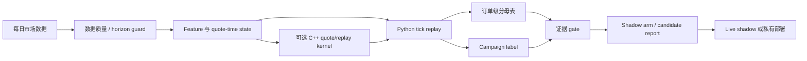

<div align="center">
  <h1>NarrowGate</h1>
  <p>Maker 策略研究、因果回放与 live/replay 一致性框架。</p>
  <p><a href="README.md">English</a> | <a href="README.zh-CN.md">简体中文</a></p>
</div>

Last materially modified: 2026-08-23

> Publication note: `${NARROWGATE_*}` values and deployment-epoch names are logical locators. Owner-side data and machine artifacts are in the private evidence store and are not distributed with this repository unless a repository-relative link is provided. See the [public/private documentation contract](docs/public_private_documentation_contract.md).

NarrowGate 是一个 maker 策略研究框架，用于研究被动报价选择、库存 campaign、tick replay，以及 Python/C++ 执行一致性。

它**不是**打包好的交易机器人，也不附带已经晋级的 live 参数集。公开仓库聚焦于证据框架：

- 按冻结 identity 选择每日 fresh-start 或版本化 continuous/restart-aware replay；
- 使用订单级分母表，而不是只分析成交后的幸存者；
- 使用最大库存、持续时间、最大不利偏移（Maximum Adverse Excursion，`campaign MAE`）、repair 和 terminal outcome 等 campaign 级库存标签；
- 在解读 PnL 之前先对齐 live/replay 机制；
- 对经过 parity 验证的热点循环和快速筛选，可选用 C++ 加速。

术语约定：仓库中的 `campaign MAE` 始终指 Maximum Adverse Excursion；预测或模型评估语境中的 `prediction MAE` / `model MAE` 才指 Mean Absolute Error（平均绝对误差）。两者不得混用。

当前运营入口：live 主机是 AWS Tokyo `<current-live-host>`（`<current-live-instance>`）。原 AWS、中间 Vultr 与再激活 AWS 前任均为历史主机，只能查询本地 `${NARROWGATE_PRIVATE_EVIDENCE_ROOT}` 校验归档。参见[当前主机与数据查询合同](docs/live_host_and_historical_data_access_20260811.md)。成交查询必须按四个 host epoch 和三个维护缺口分段；当前 AWS 与任一前任的数据不得互相补齐相邻 epoch 的缺口。历史行情、live 和延迟证据仍可用于研究、经验分布/敏感度与 source-aware panel，但必须保留原 host/provider 标签。

## 稳定公开版本

受支持的公开软件快照是 annotated Git tag `v0.1.1`，与 `pyproject.toml` 中的包版本一致。需要可复现环境时应固定该 tag；发布后 `main` 可能继续包含新的受治理改动：

```bash
git clone --branch v0.1.1 --depth 1 <repo-url> narrowgate
```

研究重建 tag 和 execution-attempt tag 是证据身份，不是软件 release。软件 release 不包含 owner-side 数据，不授予研究或 live 权限，也不证明任何私有 artifact 的经济价值。参见[源码、研究与执行身份](docs/opensource/identity_and_release.md)。

## 摘要

NarrowGate 的目标，是让错误的 maker 结论更难通过验证。

1. Maker 成交并不自动等于赚到价差；它可能是 toxic flow。
2. 跨市场/参考数据适合作为 moderator 或风险标签，但全局 `multi_market.enabled` 开关本身不是 alpha。
3. Queue ahead、latency、fill gate、cooldown、TTL 和 campaign state 都可能改变 bar backtest 的结论。
4. C++ 用于边界稳定的位置：报价数学、部分 tick replay、signal state 和紧凑 live hot-path 实验。Python 仍然是研究与证据层。

> **2026-07-15 replay 完整性提示：**旧的 10 秒 ML 产物会在 tick replay 中提前 10 秒暴露左标签 feature bucket。正式 replay 现在要求 bucket-end metadata 和 causal warmup；所有旧 model bundle 在用于晋级前都必须重新训练。正式 replay 还采用合并的 trade/BBO/L2/100ms timer 时钟，使生命周期状态不再等待下一笔 execution trade。参见 [修复说明](research/system_engineering/docs/replay_time_unit_causality_repair_20260715.md)。
>
> **历史 event-L2 边界：**Binance individual `trades` 保留撮合事件，但不披露 cancel/refill。因此，保留的 sub-second/100ms book-path 研究会把 individual trades 与 CryptoHFTData 的 price-level delta 结合起来。Native-snapshot reconstruction 仍是严格层级；明确标记为 `delta-converged` 的 top-20 数据是另一研究层级，绝不能当作精确 deep-queue 真值。参见 [行情数据指南](docs/market_data.md#retained-event-l2-rebuild)和 [逐行验证](docs/retained_event_l2_rebuild_20260718.md)。

## 行情数据源

市场身份始终使用 `venue:instrument:symbol`；显示 symbol 相同的 feed，在经过明确的 consensus 或 conversion 步骤之前不会合并。下表描述的是已经实现的路径，并不表示所有可选数据源都已在生产中启用。受 Git 跟踪的公开模板默认关闭 `multi_market`、所有 external venue，以及独立 deep book。

| 层级 | Venue | Instrument / symbol | 传输或归档数据 | 用途 | 可以下单？ | 公开模板状态 |
| --- | --- | --- | --- | --- | --- | --- |
| Execution | Binance USD-M | `BTCUSDC` perpetual | Live `aggTrade`、100ms top-20 partial depth、`bookTicker`；private user stream；可选 REST snapshot + 100ms diff-depth book | 报价、成交、库存、execution BBO/L2，以及可选的 active-order queue/path state | **可以**，通过 Binance USD-M REST order API | 核心路径；模板使用 testnet。独立 deep book 已实现但默认关闭 |
| Binance reference | Binance USD-M | `BTCUSDT` perpetual | Live `aggTrade` 和 `bookTicker`；历史官方 individual-trade 1s bar | 跨 symbol 价格/flow 参考和因果历史 local bridge；本仓库不会用它执行交易 | 不可以 | 位于 `multi_market` 后；默认关闭 |
| Binance reference | Binance spot | `BTCUSDC` 和 `BTCUSDT` | Live `bookTicker` 和 `aggTrade` | Spot anchor、交叉核验和 cross-instrument feature | 不可以 | 仅用于 `enhanced`/`full` multi-market stage；默认关闭 |
| Binance reference | Binance spot | `USDCUSDT` | 仅 live `bookTicker` | `BTCUSDT / USDCUSDT -> BTCUSDC` 的稳定币换算 anchor | 不可以 | 仅用于 `enhanced`/`full` multi-market stage；默认关闭 |
| Cross-venue shadow | Bitget | `BTCUSDT` perpetual 和 spot | Public v3 WebSocket `books1` + `publicTrade` | Receive-time reference、flow 和 toxicity 证据 | 不可以 | 只读 adapter 已实现；两类 source 均默认关闭 |
| Cross-venue shadow | Bybit | `BTCUSDT` linear perpetual 和 spot | Public v5 WebSocket `orderbook.1` + `publicTrade` | Receive-time reference、flow 和 toxicity 证据 | 不可以 | 只读 adapter 已实现；两类 source 均默认关闭 |
| Cross-venue shadow | OKX | `BTC-USDT-SWAP` 和 `BTC-USDT` spot | Public WebSocket `bbo-tbt` + `trades` | Receive-time reference、flow 和 toxicity 证据 | 不可以 | 只读 adapter 已实现；两类 source 均默认关闭 |
| Historical archive | Binance Vision | USD-M `BTCUSDC` / `BTCUSDT`；指定的 spot symbol | 每日 `aggTrades`；USD-M individual `trades` 和 `metrics` | Retained-day replay 输入、撮合事件 trade、bar 和 metrics；**不是历史 L2** | 不可以 | 按需下载工具，不是 live daemon |
| Historical archive | CryptoHFTData | Binance Futures `BTCUSDC` execution market | 第三方逐小时 price-level snapshot/delta `.parquet.zst`，归一化为每日 BBO/100ms top-20 L2 | execution book path 与 queue 研究；eligible 必须通过严格 coverage 和 sequence 审计 | 不可以 | 需认证且数据不完整的第三方来源；仅按需下载 |
| Historical archive | Tardis delivery | Binance Futures `BTCUSDC` execution market | 每日 `incremental_book_L2` 与原生 `book_ticker` `.csv.zst` | 作为修复 CryptoHFTData 缺失日期的独立候选来源；必须另行通过 bootstrap、timestamp、BBO、coverage 和 gap gate | 不可以 | 已实现断点续传；绝不改标为 CryptoHFTData，下载完成本身不授予研究资格 |
| Historical archive | Bitget | `BTCUSDT` perpetual 和 spot | Perpetual：近期 public fills REST；perpetual/spot：官方 retained archive import | UTC 归一化 trade history 和 causal 1s reference feature | 不可以 | 按需；超过近期 REST 窗口必须使用 archive |
| Historical archive | Bybit | `BTCUSDT` perpetual 和 spot | Public daily trade archive | UTC 归一化 trade history 和 causal 1s reference feature | 不可以 | 按 retained day 下载 |
| Historical archive | OKX | `BTC-USDT-SWAP` 和 `BTC-USDT` spot | UTC+8 daily history ZIP 下载/导入，用 `D` 和 `D+1` 拼接 | UTC 归一化 trade history 和 causal 1s reference feature | 不可以 | 按 retained day 下载/导入 |

只有 Binance USD-M `BTCUSDC` 是 execution market。所有 reference connector 均为只读；公开配置不会把 reference feed 自动转化为 quote policy。Binance Vision 与 CryptoHFTData 的语义不同：Vision 提供公开的 trade/aggregate trade/metrics；CryptoHFTData 是另行治理的 BTCUSDC execution price-level book 来源。历史 BTCUSDT bridge 使用右边界可见、freshness 有上限的官方 individual-trade 1s bar，不再依赖另一套 CryptoHFTData orderbook；live 仍使用 BTCUSDT book ticker。

## 5 分钟快速开始

NarrowGate 要求 Python 3.11 或更高版本；可执行文件不必恰好名为 `python3.11`。先检查本机已有解释器：

```bash
python3 --version
```

若该命令报告 Python 3.11 或更高版本，使用 `PYTHON=python3`。否则先安装受支持的解释器。默认 Quickstart 使用无需数据的基础 Demo 安装；research、live 与 contributor 依赖矩阵见[英文 README](README.md#5-minute-quickstart)。

```bash
git clone <repo-url> narrowgate
cd narrowgate

PYTHON="${PYTHON:-python3}"
"$PYTHON" -c 'import sys; assert sys.version_info >= (3, 11), sys.version'
"$PYTHON" -m venv .venv
source .venv/bin/activate
python -m pip install --upgrade pip
python -m pip install -e .

narrowgate doctor
narrowgate quote-demo
python examples/order_level_score_demo.py
python -m unittest discover -s tests -p 'test_public_onboarding.py' -v
```

预期结果：

- `narrowgate doctor` 输出 dependency 和 path 状态；基础 Demo 未安装的可选 research/C++ 依赖可能显示 `false`；
- `narrowgate quote-demo` 计算一个无需数据的 quote-core 示例；
- onboarding smoke test 无需 pytest、网络或私有市场数据即可通过。

可选 C++ extension：

```bash
python -m pip install -e cpp
python -c "import narrowgate_cpp; print(narrowgate_cpp.__file__)"
```

## 正式无数据验证

除 Quickstart smoke 外，公开仓库恰好有两条正式验证路径。Live 输入的唯一正式 dry-run 是 `bash live/run.sh dry-run`；它完成本地配置与完整模型合同校验后，在创建任何网络客户端、线程、引擎或订单路径之前退出，详见 [Live / Dry-Run Boundary](docs/ops/live_dry_run.md)。Synthetic replay demo 的唯一入口是 `narrowgate replay-demo --output-dir results/replay_demo --verify-reference`；它在不读取私有数据、不取得经济或 live authority 的前提下，确定性验证 queue、fill、campaign、accounting 与 fail-closed evidence mechanics，详见 [Public Replay Demo](examples/replay_demo/README.md)。

## 本仓库适合做什么

如果你希望检查或复用以下内容，NarrowGate 会很有用：

- market-making 证据工作流；
- tick replay 与 live/replay parity 思路；
- order-level 和 campaign-level label；
- data-quality 与 horizon/gap guard；
- 低延迟研究系统中的 Python/C++ 边界设计。

它并不是一条命令就能盈利的策略。公开配置只是模板，私有 live 参数与结果不会包含在仓库中。

## 配套文章

以下长文解释当前研究与工程边界：

- [NarrowGate: Maker Quote EV Research Framework](https://xiao-nanbei.github.io/2026/06/19/NarrowGate-Maker-Quote-EV-Research-Framework/) 介绍 maker alpha/证据侧：数据质量、daily replay、quote EV、null baseline、order-level fill selection、campaign label，以及为何旧的 direct xmarket/quote-EV arm 被降级。
- [NarrowGate: Replay Throughput and Live Tail-Latency Engineering](https://xiao-nanbei.github.io/2026/07/01/NarrowGate-Cpp-Low-Latency-Market-Making/) 介绍系统侧：Python/C++ parity、replay 加速、紧凑 live hot-path 设计、x86 soak 结果，以及哪些 C++ 路径只适合快速筛选。

## 架构



## 仓库结构

| 路径 | 用途 |
| --- | --- |
| `narrowgate/` | 稳定的公开 CLI facade |
| `strategy/` | Quote core、maker engine、signal/inventory logic |
| `models/`、`models/audit/` | 稳定 import/CLI ABI，以及共享 replay 和实验治理基础设施 |
| `research/` | 十个研究族、共享合同、系统工程证据与版本化路径治理；见[研究族目录](research/README.md) |
| `data/`、`features/` | 离线下载、导入、规范化代码与 feature engineering；行情文件不放在仓库内 |
| `live/orderbook/` | Live 执行市场公共盘口重建，不存历史行情文件 |
| `execution/` | 绑定我方活动订单的 queue/path 状态 |
| `cpp/` | 可选 pybind11/C++ 加速模块 |
| `examples/` | 面向新用户的无数据示例 |
| `docs/` | 跨研究族的行情数据、Feature DAG、scorecard、cache、路径和仓库治理文档；family-owned 证据位于 `research/families/*/docs/` |
| `docs/ops/` | Dry-run 与部署 guardrail |
| `docs/dev/` | 开发、CI 和 C++ build 说明 |
| `docs/private/` | 被忽略的本地说明；绝不发布 |

长篇设计日志保留在 [project.md](project.md) 中；它有意比 README 更详细。

历史 `models/*`、`models/audit/*`、`features/*`、`docs/*`、部分 `cpp/narrowgate_cpp/*` 以及根目录 `research_*` 研究路径已经物理移除，不保留兼容符号链接。当前 import 使用规范的 `research.families.*` package；版本化路径映射与迁移边界旧字节统一保存在 `research/governance/` 下。

## 数据布局

大型数据位于 Git checkout 之外：

```bash
export NARROWGATE_ROOT="$PWD"
export NARROWGATE_MARKETDATA_ROOT="<local-marketdata-root>"
export NARROWGATE_DATA_ROOT="$NARROWGATE_MARKETDATA_ROOT/NarrowGate_BTCUSDC"
export NARROWGATE_CACHE_ROOT="$HOME/Library/Caches/NarrowGate_BTCUSDC"
export NARROWGATE_RESULTS_DIR="$NARROWGATE_DATA_ROOT/backtest_results_btcusdc"
export MM_DATA_ROOT="$NARROWGATE_DATA_ROOT"
```

原始、规范化、模型、报告和证据数据保存在 `${NARROWGATE_PRIVATE_EVIDENCE_ROOT}`；可重建 replay cache 保留在内置盘的 `NARROWGATE_CACHE_ROOT`。

优先使用 daily container：

- `raw_trades/<SYMBOL>/<SYMBOL>-trades-YYYY-MM-DD.csv`
- `normalized_l2_100ms_v2/bbo/BTCUSDC-bbo-YYYY-MM-DD.parquet`
- `normalized_l2_100ms_v2/l2/BTCUSDC-l2-YYYY-MM-DD.parquet`
- `features_btcusdc/features_YYYY-MM-DD.parquet`
- `metrics_5m/<SYMBOL>-metrics-YYYY-MM-DD.parquet`

完整目录树、source provenance、UTC normalization 与 retained-day 规则见 [docs/market_data.md](docs/market_data.md)。历史顶层 `bbo/` 和 `l2/` root 只用于迁移，新 BTCUSDC 研究不得 glob 它们。CryptoHFTData 明确被视为不完整的第三方/个人收集，而非 Binance 官方 archive；文件存在绝不代表该日具备研究资格。本机直接使用 APFS `${NARROWGATE_PRIVATE_EVIDENCE_ROOT}` 卷，不在旧 home 目录保留兼容符号链接。冻结证据仍保留原始 provenance 字符串，由[存储迁移合同](docs/marketdata_storage_relocation_20260730.md) 在文件系统边界完成路径映射。

### 独立 venue shadow 数据

External venue 使用 `venue:instrument:symbol` 标识；例如 `binance:perp:BTCUSDT`、`bitget:perp:BTCUSDT`、`bitget:spot:BTCUSDT`、`bybit:spot:BTCUSDT`、`okx:perp:BTCUSDT` 和 `okx:spot:BTCUSDT` 绝不共享状态。只读 adapter 支持 Bitget public v3 WebSocket `books1`/`publicTrade`、Bybit public WebSocket `orderbook.1`/`publicTrade`，以及 OKX public WebSocket `bbo-tbt`/`trades`，spot 与 perpetual 均覆盖。REST 只用于 bootstrap、recovery 和低频比较。所有 adapter 都保留 exchange event time 与本地 receive time，不能下单，也不需要 API key。

只允许在私有配置中把它作为 shadow input 启用：

```yaml
external_venues:
  enabled: true
  shadow_only: true
  sources:
    - venue: bitget
      enabled: true
      transport: websocket
      symbol: BTCUSDT
      instrument_type: perp
      product_type: USDT-FUTURES
      websocket_url: wss://ws.bitget.com/v3/ws/public
      book_channel: books1
      trade_channel: publicTrade
    - venue: bybit
      enabled: true
      transport: websocket
      symbol: BTCUSDT
      instrument_type: perp
      product_type: linear
      websocket_url: wss://stream.bybit.com/v5/public/linear
      book_channel: orderbook.1
      trade_channel: publicTrade
    - venue: bitget
      enabled: true
      transport: websocket
      symbol: BTCUSDT
      instrument_type: spot
      product_type: SPOT
      websocket_url: wss://ws.bitget.com/v3/ws/public
      book_channel: books1
      trade_channel: publicTrade
    - venue: bybit
      enabled: true
      transport: websocket
      symbol: BTCUSDT
      instrument_type: spot
      product_type: spot
      websocket_url: wss://stream.bybit.com/v5/public/spot
      book_channel: orderbook.1
      trade_channel: publicTrade
    - venue: okx
      enabled: true
      transport: websocket
      symbol: BTCUSDT
      instrument_type: perp
      product_type: SWAP
      instrument_id: BTC-USDT-SWAP
      contract_multiplier: 0.01
      websocket_url: wss://ws.okx.com:8443/ws/v5/public
      book_channel: bbo-tbt
      trade_channel: trades
    - venue: okx
      enabled: true
      transport: websocket
      symbol: BTCUSDT
      instrument_type: spot
      product_type: SPOT
      instrument_id: BTC-USDT
      contract_multiplier: 1.0
      websocket_url: wss://ws.okx.com:8443/ws/v5/public
      book_channel: bbo-tbt
      trade_channel: trades
```

每个 external connector 都是 shadow evidence，而不是 execution feed。WebSocket 行保留 exchange、receive 和 feature-ready timestamp。`book_stale` 控制 reference availability；trade silence 只标记 `trade_stale`。Top-of-book 变化可以支持 L1 OFI/depletion/refill proxy，但不支持精确 L2 cancel attribution。

运行无需 key 的 connector preflight 和 fill-time toxicity audit：

```bash
python scripts/preflight_external_venues.py --config live/config.yaml --duration-s 15

python research/families/f05_fill_quality_quote_ev/audit/fill_toxicity.py \
  --input 'logs/market_tape/*.jsonl.gz' \
  --input 'logs/external_venues/*.jsonl.gz' \
  --fills logs/trades.csv \
  --output-prefix logs/audit/global_flow_fill_toxicity
```

Market-data delay 必须绑定到实际测量它的 host 和 transport。先构建 3600 秒 profile，再显式选择 replay visibility model：

```bash
python research/system_engineering/audit/market_data_latency.py \
  --input logs/market_tape \
  --input logs/external_venues \
  --output-json live/profiles/latency/<profile>.json \
  --output-md docs/<profile>.md \
  --profile-id <environment-and-window-id> \
  --window-seconds 3600 \
  --transport websocket \
  --environment cloud=AWS \
  --environment region=ap-northeast-1 \
  --environment instance_type=t3.medium \
  --environment public_ipv4=<current-live-host>

python research/families/f05_fill_quality_quote_ev/audit/fill_toxicity.py \
  --input 'logs/market_tape/*.jsonl.gz' \
  --input 'logs/external_venues/*.jsonl.gz' \
  --fills logs/trades.csv \
  --output-prefix logs/audit/global_flow_fill_toxicity_p50 \
  --market-data-latency-profile live/profiles/latency/<profile>.json \
  --market-data-latency-mode profile_p50
```

`captured` 使用记录的 `feature_ready_ts_ns`，不再增加延迟；`exchange_zero` 是理想化的 zero-feed-delay control；`profile_*` mode 根据 exchange time 重建 p50/p95/p99/p99.9/max 或 empirical visibility。不要把 profile mode 应用到 captured receive-time evidence 后称为“actual”。`profile_stable_spike` 是固定 seed 的 sensitivity，其中有 0.5% p95-p99 stall 分支；它不是主要 ranking baseline。

冻结的原 AWS、Vultr Tokyo 与再激活 AWS 前任 profile 仍可作为保留 host 标签的历史先验/敏感度复用，但不得改标成当前 AWS transport 实测。

Latency profile 是 host assumption，不是 strategy parameter。Instance type、region、OS/runtime/native build、feed set、recorder、transport、gateway 或 strategy workload 发生变化时，都必须重新构建并选择 profile。更快的机器也必须获得新的 profile ID 和 replay，不能沿用旧的毫秒数值。

保留的 retained111 reference report 仍是冻结的 causal-one-second diagnostic。新的 maker evidence 使用 receive-time event 和 10/25/50/100/250/500ms maker-signed markout；两条路径本身都不会改变 live quote。

Python tick replay 现在具备共享 feature-ready multi-tape scheduler，并默认使用 no-op `MultiMarketPolicy`。在修正 event clock、feature-ready contract 和 empirical-P3 baseline 之前生成的历史 stop-add、fixed-rearm、fixed-cooldown 与 one-tick response 结果，已经从公开 evidence surface 移除。它们不能用于选择参数或声称 action uplift。

当前 strategy evidence 从已知 propensity、campaign-level reward attribution 的冻结 randomized action panel 出发。当前 rolling live 身份是 [operational baseline v12](research/families/f10_live_replay_attribution/docs/operational_baseline_identity_20260820_v12.json)，由 [operational_baseline_current.json](research/families/f10_live_replay_attribution/docs/operational_baseline_current.json) 解析。它保留 v11 的 13-head semantics-v6 模型、empirical P3、q90 action-OFF、BUY fill-selection action/shadow-OFF，以及 owner-risk-accepted SELL Boolean cooldown。v12 只是 host-only migration identity，不改变策略、模型、配置、action 或 research permission。

当前 pooled 50 日回测 denominator 是 [`current_live_held_global_ber_control`](research/families/f10_live_replay_attribution/docs/current_live_held_ber_replay_baseline_50d_20260810.json)。它严格复刻 live BER 时钟：持有最近一个已完成 canonical 10 秒桶的 `trade_intensity_60s`，并在已完成 1 秒 bar 回调上采样。冻结的 daily-fresh-start 前 40 日结果为 terminal MTM `-144.251748 USDC`、closed-campaign `-147.466348 USDC`、`17,118` fills；新增 10 个 Grade-A 日分别贡献 `-21.314331 USDC`、`-21.064631 USDC` 和 `3,029` fills。合并 50 日结果为 terminal MTM `-165.566079 USDC`（`-3.311322/day`）、closed-campaign `-168.530979 USDC`、`20,147` fills。

这组数字的准确身份是 native-derived top-20/100ms C++ daily-fresh-start diagnostic。50 日中的任何一天都没有消费 raw snapshot/delta queue tape、经验 REST 延迟或 AWS receive/feature-ready 可见延迟。因此它可继续用于同模拟器成对诊断，但不能授权会改变订单路径的 action。下一版必须使用 strict raw-native Python replay 和冻结的 Tokyo 延迟 profile；边界见[执行范围勘误](research/families/f10_live_replay_attribution/docs/current_live_held_ber_replay_baseline_50d_execution_scope_amendment_v1_20260810.md)。该 successor 已通过全部 50 日 source preflight，并在 `2026-06-29` 完成一日 strict mechanics：消费 508.6 万条 raw book events，19,460 次 queue lookup 全部 exact 或 known-zero，missing 为零，visibility delay 实际应用 14,825 次。该日 terminal MTM 从旧诊断路径的 `-7.878888` 变为 `-7.132700 USDC`，因此严格 50 日结果必须重算，不能由旧 pooled 数字外推。连续状态实验还须跨 UTC 午夜保留现金、库存、campaign 和 cooldown。

这次 owner-directed operational promotion 不等于独立研究确认：campaign q10 未决，research prediction/live authority 仍为 false。旧部署身份只承担回滚与 provenance，不再承担当前回测 control。精确历史证据边界见 [research/families/f10_live_replay_attribution/docs/historical_backtest_evidence_revalidation_20260720.md](research/families/f10_live_replay_attribution/docs/historical_backtest_evidence_revalidation_20260720.md)。

按照同一 retained UTC-day manifest 下载/审计 Bitget trade：

```bash
python pipeline.py download-bitget \
  --manifest "$NARROWGATE_ROOT/logs/data_audit/<retained-manifest>.csv" \
  --out-dir "$NARROWGATE_DATA_ROOT/external_venues/bitget/perp/BTCUSDT/trades"

# Add --execute --workers 5 to download API-eligible days.
```

Bitget public fills-history REST endpoint 只覆盖最近 90 天。更早的 retained day 会在生成的 manifest 中保持 `archive_required`，必须从 Bitget history-download archive 获取；不能因为近期日期下载成功，就把历史日期视为完整。使用同一 retained manifest 导入这些 ZIP part：

```bash
python pipeline.py import-bitget \
  --manifest "$NARROWGATE_DATA_ROOT/external_venues/bitget/perp/BTCUSDT/trades/bitget_BTCUSDT_archive_required_good_days.csv" \
  --archive-dir <bitget-download-directory> \
  --out-dir "$NARROWGATE_DATA_ROOT/external_venues/bitget/perp/BTCUSDT/trades"
```

Bitget archive 文件名使用 UTC+8 calendar day。Importer 根据每行 timestamp，拼接 archive day `D` 和 `D+1` 来重建一个 UTC research day；绝不能直接把 ZIP 日期重命名为 NarrowGate UTC-day 文件。NarrowGate 的 Bitget、Bybit 与 OKX reference collector 只使用 public WebSocket/REST channel，不读取 external- venue API key。

Bitget spot history 可从公开下载目录获取，并由同一个 UTC-aware importer 归一化：

```bash
python pipeline.py import-bitget \
  --manifest "$NARROWGATE_DATA_ROOT/external_venues/bitget/perp/BTCUSDT/manifests/<retained111>.csv" \
  --archive-dir "$NARROWGATE_DATA_ROOT/external_venues/bitget/spot/BTCUSDT/archive_source_utc8" \
  --out-dir "$NARROWGATE_DATA_ROOT/external_venues/bitget/spot/BTCUSDT/trades" \
  --instrument-type spot --product-type SPOT \
  --download-missing --download-workers 2 --cleanup-archives
```

所有 retained day 通过 daily completeness audit 后，再构建 causal 1 秒 trade reference feature：

```bash
python pipeline.py external-features \
  --manifest "$NARROWGATE_ROOT/logs/data_audit/<retained-manifest>.csv" \
  --trades-dir "$NARROWGATE_DATA_ROOT/external_venues/bitget/perp/BTCUSDT/trades" \
  --out-dir "$NARROWGATE_DATA_ROOT/external_venues/bitget/perp/BTCUSDT/features_1s" \
  --workers 4
```

Bybit 提供 daily public BTCUSDT contract-trade archive，因此 retained day 可以直接下载，无需分页调用 recent-trades REST endpoint：

```bash
python pipeline.py download-bybit \
  --manifest "$NARROWGATE_ROOT/logs/data_audit/<retained-manifest>.csv" \
  --out-dir "$NARROWGATE_DATA_ROOT/external_venues/bybit/perp/BTCUSDT/trades" \
  --workers 3

python pipeline.py external-features \
  --venue bybit \
  --manifest "$NARROWGATE_ROOT/logs/data_audit/<retained-manifest>.csv" \
  --trades-dir "$NARROWGATE_DATA_ROOT/external_venues/bybit/perp/BTCUSDT/trades" \
  --out-dir "$NARROWGATE_DATA_ROOT/external_venues/bybit/perp/BTCUSDT/features_1s" \
  --workers 4
```

Bybit downloader 使用可续传 `.download` 文件，按其 UTC retained day 验证每个 event，不经数值强转地保存 UUID trade ID，并且只在写完完整 metadata 后才让该日获得研究资格。网站的 OrderBook 产品单独治理；daily trade 不会被当作历史 L2。当前 retained111 build 包含 252,387,353 笔 trade 和 7,276,709 个 causal 1 秒 state，trade 与 feature metadata 均为 111/111 完整。

为 Bybit spot archive 传入 `--instrument-type spot`，并使用 `external_venues/bybit/spot/BTCUSDT`。Spot 与 perp 的 source filename 和 CSV column 不同；downloader 会分别验证、归一化两个 schema。Retained111 spot 层包含 40,287,185 笔 Bitget trade、106,016,009 笔 Bybit trade 和 69,915,914 笔 OKX trade。Robust three-venue build 产生 7,747,571 个 spot-consensus state、9,225,272 个 perpetual-consensus state 和 7,547,083 个 fresh spot/perp cross-instrument state；这些仍是 shadow evidence，不会改变 live quote。

OKX history-download ZIP 同样采用 UTC+8 日界。一个完整 UTC day 需要 source file `D` 和 `D+1`；只归一化 retained date，并在 metadata 验证后删除 source ZIP：

```bash
python pipeline.py import-okx \
  --manifest <retained-manifest.csv> \
  --archive-dir "$NARROWGATE_DATA_ROOT/external_venues/okx/perp/BTCUSDT/archive_source_utc8" \
  --out-dir "$NARROWGATE_DATA_ROOT/external_venues/okx/perp/BTCUSDT/trades" \
  --instrument-type perp --contract-multiplier 0.01 \
  --workers 3 --cleanup-source

python pipeline.py import-okx \
  --manifest <retained-manifest.csv> \
  --archive-dir "$NARROWGATE_DATA_ROOT/external_venues/okx/spot/BTCUSDT/archive_source_utc8" \
  --out-dir "$NARROWGATE_DATA_ROOT/external_venues/okx/spot/BTCUSDT/trades" \
  --instrument-type spot --workers 3 --cleanup-source

python pipeline.py external-features \
  --venue okx --instrument-type perp \
  --manifest "$NARROWGATE_DATA_ROOT/external_venues/okx/perp/BTCUSDT/manifests/okx_BTCUSDT_retained_available.csv" \
  --trades-dir "$NARROWGATE_DATA_ROOT/external_venues/okx/perp/BTCUSDT/trades" \
  --out-dir "$NARROWGATE_DATA_ROOT/external_venues/okx/perp/BTCUSDT/features_1s"
```

两个 OKX layer 目前都覆盖 111/111 retained UTC day：perpetual 有 399,947,490 笔 normalized trade 与 8,742,874 个 causal state；spot 有 69,915,914 笔 trade 和 5,846,509 个 state。Full 与 leave-one-venue-out Stage 0 audit 仍然缺少稳定的 short-horizon 和 campaign support，因此不会激活 quote policy。

Binance `USDCUSDT` spot 是本地 currency-conversion anchor，不是 external vote。该交易对报价为每 USDC 对应多少 USDT，因此 level bridge 为 `BTCUSDT / USDCUSDT -> BTCUSDC`。历史 anchor 数据只下载 retained UTC day；one-second bar 验证后会删除 raw CSV/ZIP 输入。BTCUSDC spot 仍作为 cross-check 与 fallback。公式、leave-one-venue-out table、限制和待独立复核问题，见 [retained111 Stage 0 报告](research/families/f04_external_market_alpha/docs/global_reference_stage0_retained111_20260711.md) 与[评审 memo](research/families/f04_external_market_alpha/docs/global_market_reference_review_memo_20260711.md)。实现顺序和 promotion gate 见 [cross-venue reference-to-alpha roadmap](research/families/f04_external_market_alpha/docs/cross_venue_reference_to_alpha_roadmap_20260711.md)。

Feature timestamp 是右边界：`[t, t+1s)` 内的 trade 在 `t+1s` 才可见。Historical trade timestamp 支持 shadow sorting 与 risk moderation 研究，但不能重现 live receive-time cancel latency。

## 公开配置与私有配置

受跟踪的 [live/config.yaml](live/config.yaml) 是**公开模板**。它可以安全加载，但不是 live parameter snapshot。

私有 runtime config 应在本地被忽略：

```bash
export NARROWGATE_LIVE_CONFIG="$PWD/docs/private/live_config.current.local.yaml"
bash live/run.sh start
```

`make deploy` 会拒绝标记为 `PUBLIC TEMPLATE` 的配置，并且只接受模型头与 bundle manifest 都明确授权 live、且由哈希绑定的模型包。公开 synthetic、`public_dry_run_only`、`research_only`、缺少授权或 `authority.live=false` 的 artifact 都会在任何远程同步前 fail closed。Preflight 还会输出有效 P3 artifact identity；非零 P3 override 必须有显式的 `NARROWGATE_ALLOW_P3_OVERRIDE_DEPLOY=1` trial unlock。

### 持久化 live runtime profile

`live/run.sh` 从未跟踪的 `live/.env` 加载 Binance execution credential，然后从 `live/profiles/` 加载不含 secret 的 compute profile。这样，native flag 不会在 config 或 code restart 后静默消失：

```bash
# Inspect exactly what the next start will persist.
NARROWGATE_LIVE_PROFILE=native bash live/run.sh profile

# Controlled Python implementation window using the same config/thread limits.
NARROWGATE_LIVE_PROFILE=python bash live/run.sh restart

# Strict native quote/signal/routing window.
NARROWGATE_LIVE_PROFILE=native bash live/run.sh restart
```

Startup log 包含 profile name、每个 `NARROWGATE_CPP_*` flag 和加载的 extension path。Strict native mode 在 module/API 缺失时退出，不会悄悄测量 Python fallback。

Native profile 还启用 `NARROWGATE_CPP_GLOBAL_FLOW=1`。External venue trade frame 进入一个 fixed-array native batch，并通过一次 lock acquisition 更新 cross-market bar；它不会创建 dispatcher worker，也不会激活 quote policy。HEALTH 会暴露 accepted/stale/out-of-order/overflow counter，strict startup 要求 batch ABI。可用以下命令在目标 host 复现隔离 benchmark：

```bash
python bench/bench_global_flow_batch.py \
  --frames 1000 --frame-sizes 1 8 32 --rounds 5
```

Parity、memory 和 live-preflight 边界见 `research/system_engineering/docs/native_global_flow_batch_soak_20260711.md`。

普通 quote REST 仍为同步。Experimental async gateway 在 194 分钟 target-host soak 中表现出更差的 requote 与 order-update tail，而且几乎没有有效 coalescing，因此已经移除。Soak report 保留在 `project.md`；没有 dormant runtime switch 或 telemetry ABI 需要维护。

可比较的 soak window 使用 line-number marker，避免把 warmup/restart row 混入 report：

```bash
python scripts/analyze_live_soak.py mark \
  --profile native-sync \
  --output logs/soak/native-sync.marker.json

python scripts/analyze_live_soak.py report \
  --marker logs/soak/native-sync.marker.json \
  --output-json logs/soak/native-sync.json \
  --output-md logs/soak/native-sync.md

python scripts/analyze_live_soak.py compare \
  --baseline logs/soak/native-sync.json \
  --candidate logs/soak/native-async.json
```

Mainnet A/B orchestrator 要求显式 `ACK_LIVE_SOAK=YES` guard，并且只通过 `live/run.sh` 管理进程。

## 常用命令

```bash
# Environment/path check
narrowgate doctor
narrowgate paths

# No-data demos
narrowgate quote-demo
python examples/order_level_score_demo.py

# Parameter coverage / racing smoke
python research/families/f01_fixed_parameter_racing/parameter_racing_sweep.py \
  --symbol BTCUSDC \
  --tag public_quick \
  --stage quick-smoke \
  --groups spread guard cooldown execution

# Unified audit runner entrypoint
python -m research.families.f10_live_replay_attribution.audit.runner --help

# Side-specific exposure-increasing campaign-tail calibration
python -m research.families.f09_campaign_action_uplift.audit.campaign_tail_score --help

# Action-level policy learning / counterfactual evaluation
python -m research.families.f09_campaign_action_uplift.audit.offline_policy_evaluation --help
```

Offline evaluator 要求完整 decision/action panel，在 out-of-fold 中估计 behavior propensity 和 action-specific outcome，并同时报告 DM/IPS/SNIPS/ doubly-robust value，以及 overlap 和 effective-sample-size gate。只包含已下单或只包含成交的 score table，会被明确拒绝，不能用它替代 baseline 从未尝试的 action。参见 [OPE contract](research/families/f09_campaign_action_uplift/docs/offline_policy_evaluation_20260712.md)。

下一代 strategy boundary 已实现为有界、state-conditioned action layer，而不是另一次 global parameter sweep。固定 quote parameter 仍是 safety envelope；冻结 artifact 只能在 exposure-increasing add surface 上选择 baseline、prevent-over-widen、widen one tick 或 re-center one tick。Python replay 与 live shadow 共享同一 action geometry；不支持的 C++ run 会 fail fast；任何 artifact 未取得 promotion evidence 前都不会在 live 启用。当前 action evidence 记录在：

- [side-specific randomized audit](research/families/f09_campaign_action_uplift/docs/side_specific_action_uplift_existing_split_20260718.md)
- [BUY conditional-widen audit](research/families/f09_campaign_action_uplift/docs/buy_add_conditional_widen_causal_v4_v1_20260718.md)
- [SELL competing-risk audit](research/families/f09_campaign_action_uplift/docs/sell_add_repair_trend_skip_causal_v4_v1_20260718.md)
- [queue keep/cancel v1 audit](research/families/f07_active_order_continuation/docs/queue_value_keep_cancel_v1_20260719.md)
- [corrected cancel/re-enter v3 Development audit](research/families/f07_active_order_continuation/docs/queue_value_cancel_reenter_v3_development_20260720.md)
- [deep active-order queue probe](research/families/f07_active_order_continuation/docs/deep_active_order_queue_probe_20260720.md)

Deep probe 保留 v3 的 no-promotion 决策，但取代了其 queue mechanism 解释：top-20 fallback 改变了 queue seed、fill 和整个 inventory path。新的 queue action family 现在要求严格 active-price queue state，正式流程中不得 fallback。Watch-specific sparse replay 未通过 g0-g3 fixed-point closure gate，因此下一代 engine 必须独立于 strategy trajectory 消费 native snapshot/delta state。

真实 replay/training 命令要求 `MM_DATA_ROOT` 下存在 retained good-day market data。

## 测试与 CI

运行完整公开测试前先安装 `all` target。本地检查：

```bash
python -m pytest -q
python -m ruff check narrowgate examples data_paths.py data/audit_raw_trades.py
```

GitHub Actions 执行：

- Python install + CLI smoke；
- 对公开 surface 运行 lint；
- pytest；
- 可选 C++ extension build/import smoke。

参见 [docs/dev/ci.md](docs/dev/ci.md)。

## Docker / Devcontainer

```bash
docker build -t narrowgate .
docker run --rm narrowgate
```

VS Code 用户可以使用仓库中包含的 devcontainer 打开项目。

## 研究工作流

Promotion evidence 遵循以下顺序：

```text
data quality
  -> replay/live mechanism alignment
  -> fill selection sanity
  -> OOS bucket / score stability
  -> daily campaign and inventory gates
  -> shadow arm
  -> private live validation
```

Bucket hit 只能作为 diagnostic。将 PnL 视为有意义之前，candidate 必须保持 mechanism metric、side split、campaign risk、tail day 和 inventory-time behavior。

### 正式 Replay 完整性

对于私有 retained-data 研究，`research/families/f01_fixed_parameter_racing/campaign_outcome_replay_audit.py` 还提供两个 implementation diagnostic：

- `--integrity-diagnostic-arms` 比较 historical/off/sign-corrected markout feedback，以及 compress/pause/observe spread-cap action；
- `--random-passive-trials N` 通过完整 queue、latency、cooldown、inventory、campaign 与 terminal-accounting state machine，运行可执行 passive null。

使用 `--strict-calibration` 时必须提供显式 private config。此后，effective- kappa/fill calibration、daily queue calibration、historical BBO/L2 或 order- latency calibration 任一缺失，正式 replay 都会 fail fast。Executable null 不是可部署策略：其报告会比较 activity、spread/action mix、side split、inventory time、tail、markout 和 PnL per fill，避免 path-dependent fill count 变化伪装成 alpha。参见 [docs/audit_entrypoints_20260630.md](docs/audit_entrypoints_20260630.md)。

Replay window end 是 mark-to-market boundary，不是隐式 taker close：`final PnL = cash + inventory * terminal mark`。假想 taker-close cost 另行报告为 `terminal_liquidation_fee_estimate`，不会扣除。当前 BTCUSDC research config 使用 `maker_fee=0`；taker fee 只适用于 timeout 或 emergency liquidation 等明确 taker exit。

## 免责声明

Crypto 交易可能涉及法律、合规、运营和财务风险。本仓库用于 C++ 系统研究、market microstructure 研究、backtesting methodology 和技术教育。它不是财务建议，也不推荐或招揽交易。

## 许可证

NarrowGate 使用 [PolyForm Noncommercial License 1.0.0](LICENSE)。商业使用需要单独授权。
