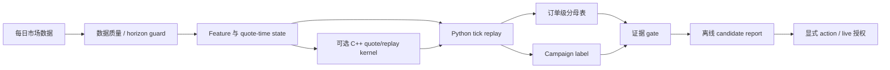

<div align="center">
  <h1>NarrowGate</h1>
  <p>沿一笔 maker 订单，查看报单、排队、成交、库存与 PnL。</p>
  <p><a href="README.md">English</a> | <a href="README.zh-CN.md">简体中文</a></p>
</div>

Last materially modified: 2026-09-22

Last materially synchronized: 2026-09-22

> 发布说明：`${NARROWGATE_*}` 值和 deployment-epoch 名称是逻辑定位器。所有者侧数据与机器产物保存在私有证据存储中；除非文档提供仓库相对链接，否则这些字节不会随本仓库分发。参见[公开/私有文档合同](docs/public_private_documentation_contract.zh-CN.md)。

NarrowGate 是一个 maker 策略研究框架，用于研究被动报价选择、库存 campaign、tick replay，以及 Python/C++ 执行一致性。可以先运行随包提供的合成回放：安装完成后，不需要交易所账户、API key、行情下载或 C++ 编译。

[新 13-head 完整研究结果](research/families/f03_causal_13_head/README.zh-CN.md)：858 次策略分片完成；Final H=inf −189.212148 USDC，对照 ML-OFF −269.042233 USDC。两组均亏损，不代表实盘盈利或已上线。

## 从这里开始

**仓库角色：** `xiao-nanbei/NarrowGateMaker-private` 是所有者唯一开发源，`xiao-nanbei/NarrowGateMaker` 是经审阅的公开源码分发。下方公开快速开始使用后者；有权限的私有开发者应克隆前者，不在两边维护分叉实现。实际代码归属及未完成迁移见[当前模块归属表](docs/architecture.zh-CN.md)。

1. [安装并运行 demo](#5-分钟快速开始)，然后[跟随第一笔订单](examples/replay_demo/README.zh-CN.md#跟随第一笔订单)。你会得到事件轨迹和记账汇总，也能看到始终没有成交的订单。
2. [带入一日真实行情](docs/opensource/one_day_data_pipeline.zh-CN.md)。逐笔成交和 bar 可用于有限诊断；缺少订单簿时会明确说明，不会冒充精确排队回放。
3. [浏览研究工具](research/README.zh-CN.md)。某个策略实验关闭，不代表回放与分析代码不能复用；软件能运行，也不代表策略有盈利能力。

源代码按 [PolyForm Noncommercial License 1.0.0](LICENSE) 公开可读。该许可证将受许可的使用限定为允许的非商业用途，因此 NarrowGate 属于**公开源码（source-available）**，不是通常意义上不限使用领域的开源软件。商业使用需要另行获得许可人的书面许可。

它**不是**打包好的交易机器人，也不附带已经晋级的 live 参数集。NarrowGate 的核心定位是**负向过滤器**：判断 maker 在什么状态下绝对不应增加风险敞口，而不是预测下一步涨跌。当毒性、波动、库存、数据质量或运行状态不安全或含糊时，默认行为必须暂停对应方向的增仓或 fail closed。任何向内压缩点差的行为都只能是显式研究 arm，不能作为安全默认值。

当前维护的报价核心是 **AS-shaped empirical quote controller（AS 形状的经验报价控制器）**，不是 Avellaneda--Stoikov 或 GLFT 的精确复现，也不声称近似其最优解。AS 只提供 reservation-price 的形状；代码中的 pair spread、regime multiplier、depth adapter 和 P3 adapter 都是经验控制。P3 估计的是固定期限、相对同侧 BBO 的 **touch opportunity**，不包含 queue-ahead 或 touch-to-fill 转换；历史兼容的局部 `-d log(P_touch)/d distance` adapter 既不是 fill hazard，也不是 AS/GLFT 的订单到达强度 `kappa`。冻结的 `2 * delta_star` 机制只是对称 pair-spread floor，不保证每一侧相对同侧 BBO 的距离。

为保持 replay、模型、JSON 与 C++ ABI 稳定，公开字段仍保留历史名称。本文把 `microprice` 解释为 top-N 数量形成的 **weighted-mid proxy**，把墙钟窗口 `vpin_*` 解释为 **clock-volume imbalance**，把 `ber_*` 解释为 **trade-intensity-burst guard**；这些名称均不表示复现同名论文 estimator。`gamma` 也只是兼容输入：`q_ref`、订单量 `z`、`eta_inventory` 与 `a_spread` 用于暴露当前实现的单位；省略新系数时只复现冻结 B0 数值，不会自动得到可跨资金规模、交易对或订单量迁移的 CARA 风险厌恶参数。

这次单位合同拆分是保持行为不变的 B0 迁移：使用 legacy mapping 时，最终 bid/ask、历史 P3 pair-spread floor、post-only correction 与 tick rounding 必须完全等价。它既不改变 live 报价，也不证明映射后的系数在经济上最优。引入含真实订单量的 quantity-aware spread、真正逐侧的 same-side-BBO floor、H5/H10 风险期限，或 variance-time cooldown，都会改变订单或 campaign 路径；它们是相互独立的研究候选，目前没有 economic、action 或 live authority。

运行时时钟也各有边界。UTC 日切只重置 daily PnL baseline、当日成交聚合等日度会计/统计状态；连续亏损状态与 session marked-equity high-water mark 会跨 UTC 日切保留，库存和未结束的 campaign 也继续存在。Execution-book visible-age/source-lag 门用于撤单或阻断报价；更长的 WebSocket silence timeout 只是 transport reconnect watchdog。公共 timeout 是部署示例，不是适用于所有 host 的延迟规律。

固定 base-asset 数量上限与固定 USDC notional、loss 或 drawdown 上限是相互独立的硬保险丝，实际以更严格的一项为准。它们不是统一且尺度不变的风险坐标，也不会随账户权益、BTC 价格、波动率、成交频率或订单暴露时间自动共同缩放。任何 equity/volatility-aware sizing 或风险预算替代方案本身仍是策略/风险候选，不能静默替换这些硬保险丝。

公开仓库聚焦于证据框架：

- 新研究事先确定连续日历，并使用版本化 continuous/restart-aware replay；每日 fresh-start 只用于明确声明的诊断或冻结的历史合同；
- 使用订单级分母表，而不是只分析成交后的幸存者；
- 使用最大库存、持续时间、最大不利偏移（Maximum Adverse Excursion，`campaign MAE`）、repair 和 terminal outcome 等 campaign 级库存标签；
- 在解读 PnL 前，先按明确冻结的数据、时钟、队列与初始状态合同核验 live/replay 机制；
- 对经过 parity 验证的热点循环和快速筛选，可选用 C++ 加速。

术语约定：仓库中的 `campaign MAE` 始终指 Maximum Adverse Excursion；预测或模型评估语境中的 `prediction MAE` / `model MAE` 才指 Mean Absolute Error（平均绝对误差）。两者不得混用。

证据标签彼此独立：**causal（因果）**描述 feature/clock 与 estimand 合同，**exact**描述字节或身份完全匹配，**formal**描述已冻结且 fail-closed 的程序，**parity**只表示两个实现在已声明假设下结果一致，**authority**则是显式权限。任何一个标签本身都不能证明公开可复现、owner 私有可复现、经济有效或允许交易。

SHA 只能证明当前读取的字节与该 digest 指定的字节相同。它不能证明数据正确、配置合理、研究没有泄漏、策略具有经济价值，也不能证明 live 进程、订单所有权安全闩和交易所对账仍然健康；这些结论必须由独立验证与持续运行检查建立。

当所有者侧证据提到 BUY E3 或 SELL owner cooldown 时，这些标签表示**已获 owner 授权的 live 风险实验**，并不表示策略通过了研究 hard gate。它们不是已经验证的最优策略；本公共仓库也不声明其中任何一个实验当前是否启用。

通用部署代码和 provider 示例可以公开。只有具体 host、账户、credential、active config/release、runtime receipt、rollback selector 与当前运营状态属于所有者私有信息。公开说明和占位符绝不授予远端控制权；解析某一次具体部署时只能使用 Git 忽略的私有配置与证据，缺失权威时必须关闭失败。

需要浏览器界面时，可使用开发中的 [Replay Studio](docs/plans/remote_replay_studio.zh-CN.md)：持久化控制服务和独立 worker 运行同一个合成演示，界面展示订单、库存和原始事件，并提供独立的已完成 owner 私有 B0 结果只读导入。目前尚不能从界面提交真实行情 B0 或 E/C 研究；请使用当前 alpha 源码运行这一界面。

## 当前 Alpha 版本

项目所有者于 2026-09-13 合并提交历史并删除现有标签。公有与私有仓库的 `main` 现在各维护一个名为 `version-alpha-20260913` 的可变根提交，后续更新继续 amend，直到所有者确认版本稳定。这不是稳定发行版。Python 与 C++ 包版本仍为 `0.1.2.dev0`，它不能唯一标识某次 alpha 修订。请从 `main` 开始，并为每次运行记录准确的 commit/tree：

```bash
git clone --branch main --depth 1 https://github.com/xiao-nanbei/NarrowGateMaker.git narrowgate
```

历史研究文档中的旧标签名称只是历史引用，不再是当前可下载的发行版。合并提交历史不代表重新运行实验，也不会把旧结果绑定到这个 alpha。仓库不包含所有者的行情数据或运行权限。参见[源码、研究与执行身份](docs/opensource/identity_and_release.zh-CN.md)。

## 摘要

NarrowGate 的目标，是让错误的 maker 结论更难通过验证。

1. Maker 成交并不自动等于赚到价差；它可能是 toxic flow。
2. 跨市场/参考数据适合作为 moderator 或风险标签，但全局 `multi_market.enabled` 开关本身不是 alpha。
3. Queue ahead、latency、fill gate、cooldown、TTL 和 campaign state 都可能改变 bar backtest 的结论。
4. C++ 用于边界稳定的位置：报价数学、部分 tick replay、signal state 和紧凑 live hot-path 实验。Python 仍然是研究与证据层。

> **2026-07-15 replay 完整性提示：**旧的 10 秒 ML 产物会在 tick replay 中提前 10 秒暴露左标签 feature bucket。正式 replay 现在要求 bucket-end metadata 和 causal warmup；所有旧 model bundle 在用于晋级前都必须重新训练。正式 replay 还采用合并的 trade/BBO/L2/100ms timer 时钟，使生命周期状态不再等待下一笔 execution trade。参见 [修复说明](research/system_engineering/docs/replay_time_unit_causality_repair_20260715.md)。
>
> **历史 event-L2 边界：**早期多来源研究使用不同的输入合同，其数据层级和结果仅作历史参考，不是当前默认值或精确深层队列真值。参见[历史逐行验证](docs/retained_event_l2_rebuild_20260718.md)；新输入工作使用当前[数据指南](data/README.zh-CN.md)。

## 行情数据

当前历史行情输入层统一称为 `data`：固定 407 日（2025-08-01～2026-09-11），BTCUSDC 永续为执行市场、BTCUSDT 永续为参考市场，使用购买的 L2 和逐笔成交。获取方式在私有配置中指定，对外操作不选择供应商、不披露交付地址。购买原件与事实、观察、Bar、特征等派生产物分开。命令和实际能力边界见[当前数据指南](data/README.zh-CN.md)。

live 传输仍是独立适配器，不因历史输入迁移自动改变。字段和统计契约一致不代表恢复原生包时序或精确订单队列。历史外部市场和混合来源研究保留原有身份与局限，不是当前数据默认路径，也不授权开启采集。

## 5 分钟快速开始

NarrowGate 要求 Python 3.11 或更高版本；可执行文件不必恰好名为 `python3.11`。先检查本机已有解释器：

```bash
python3 --version
```

若该命令存在且报告 Python 3.11 或更高版本，使用 `PYTHON=python3`。若命令不存在或版本较旧，请先安装受支持的解释器，再创建虚拟环境：

| 平台 | 安装入口 | 下文命令使用的解释器 |
| --- | --- | --- |
| 使用 [Homebrew](https://brew.sh/) 的 macOS | `brew install python@3.11` | `PYTHON="$(brew --prefix python@3.11)/bin/python3.11"` |
| Ubuntu 24.04+ 或 Debian 12+ | `sudo apt-get update && sudo apt-get install -y python3 python3-venv` | `PYTHON=python3` |
| 其他或较旧的 Linux 发行版 | 按照官方 [pyenv 安装指南](https://github.com/pyenv/pyenv#installation)，然后运行 `pyenv install 3.11 && pyenv local 3.11` | `PYTHON="$(pyenv which python)"` |

未使用 Homebrew 的 macOS 可以从 [Python 下载页面](https://www.python.org/downloads/)安装；安装后设置 `PYTHON=python3`。继续之前先验证选中的解释器：

```bash
"$PYTHON" -c 'import sys; assert sys.version_info >= (3, 11), sys.version'
```

请选择一种安装目标。extra 会在基础包依赖之上叠加：

| 用途 | 虚拟环境内的安装命令 | 安装内容 |
| --- | --- | --- |
| Demo | `python -m pip install -e .` | 基础 NumPy/Pandas/PyYAML 依赖、CLI 和无需数据的示例 |
| 公开数据获取 | `python -m pip install -e ".[data]"` | Demo 依赖，加上公开下载和规范化命令所需的 Parquet、HTTP archive 与 zstd 工具 |
| Research | `python -m pip install -e ".[research]"` | Demo 依赖，加上 Parquet、科学计算、ML 与压缩数据工具 |
| Live integration | `python -m pip install -e ".[live]"` | Demo 依赖，加上公开 REST/WebSocket connector 库；受 Git 跟踪的 live config 仍是不可部署的模板 |
| All / contributor | `python -m pip install -e ".[all]"` | Research 与 live 依赖，加上完整公开测试套件所需的 pytest 和 Ruff |

`dev` extra 只包含 pytest 与 Ruff。需要时可与其他目标组合，contributor 工作也可使用 `all`。当前获取使用 `.[data]` 和私有交付配置。旧 adapter extra 保留历史兼容，但不属于 `all`，当前 data 层既不要求也不自动选择它们。安装软件不会授予数据许可或研究准入资格。

[`requirements.txt`](requirements.txt) 是旧版 runtime/adapter 兼容依赖全集，刻意不包含 pytest 与 Ruff。新的源码 checkout 应使用上面的窄化 extra，让 demo、data、research 或 live-integration 环境只获得各自选定的依赖。 该文件从 `pyproject.toml` 生成，不再单独维护。修改依赖后运行 `.venv/bin/python scripts/export_compat_requirements.py > requirements.txt`，用 `--check` 验证。它只安装依赖，不安装本仓库源码包。

默认 Quickstart 使用无需数据的 **Demo** 目标：

```bash
git clone https://github.com/xiao-nanbei/NarrowGateMaker.git narrowgate
cd narrowgate

PYTHON="${PYTHON:-python3}"
"$PYTHON" -c 'import sys; assert sys.version_info >= (3, 11), sys.version'
"$PYTHON" -m venv .venv
source .venv/bin/activate
python -m pip install --upgrade pip
python -m pip install -e .

narrowgate doctor
narrowgate replay-demo --output-dir results/replay_demo --verify-reference
```

预期结果：

- `narrowgate doctor` 输出 dependency 和 path 状态；基础 Demo 未安装的可选 research/C++ 依赖可能显示 `false`；
- `replay-demo` 在 `results/replay_demo` 下写入 `summary.json`、`trace.jsonl` 和 `receipt.json`；`--verify-reference` 对照随包提供的预期输出；
- fixture 提交三笔订单：两笔成交，一笔未成交撤销，最终库存归零。合成 PnL 用于说明记账，不代表策略预期收益，详见[逐步说明](examples/replay_demo/README.zh-CN.md)。

以下小型检查同样不需要交易所访问或私有数据：

```bash
narrowgate quote-demo
python examples/order_level_score_demo.py
python -m unittest discover -s tests -p 'test_public_onboarding.py' -v
```

可选 C++ extension：

```bash
python -m pip install -e cpp
python -c "import narrowgate_cpp; print(narrowgate_cpp.__file__)"
```

上面的本地 demo 仍是五分钟入口。若要把公开代码部署到自行创建的 AWS EC2，请继续阅读[通用部署流程与 AWS EC2 示例](docs/ops/README.zh-CN.md)。部署 kernel 和占位符教程属于公共区域；目标地址、credential、active config、artifact、hash、release identity 与 receipt 由部署者私下提供。

## 离线检查及其边界

Replay demo 将合成排队、生命周期和记账结果与公开参考文件对照。它不模拟实测网络延迟，也不重建交易所的隐藏订单队列。另一条 `bash live/run.sh dry-run` 检查 live 输入，并在创建网络客户端、线程、引擎或订单路径前退出，不会启动交易，详见 [Live / Dry-Run Boundary](docs/ops/live_dry_run.zh-CN.md)。两种检查都不证明策略盈利，也不代表完成实盘部署。

## 参与

普通改动和研究改动请先阅读[公开源码（source-available）导航](docs/opensource/README.zh-CN.md)与[贡献指南](CONTRIBUTING.zh-CN.md)；漏洞请遵循[安全策略](SECURITY.zh-CN.md)。[单日数据流水线](docs/opensource/one_day_data_pipeline.md)说明公开 trade archive、可选认证 L2、诊断 replay 与正式证据之间的真实边界。维护者应配置[分支保护](docs/dev/ci.zh-CN.md#分支保护)中记录的精确 required check 名称。

## 本仓库适合做什么

如果你希望检查或复用以下内容，NarrowGate 会很有用：

- market-making 证据工作流；
- tick replay 与冻结 replay/live 假设下的实现一致性思路；
- order-level 和 campaign-level label；
- data-quality 与 horizon/gap guard；
- 低延迟研究系统中的 Python/C++ 边界设计。

它并不是一条命令就能盈利的策略。公开配置只是模板，私有 live 参数与结果不会包含在仓库中。

## 研究地图与长文

请以 [NarrowGate 研究项目地图：12 个科学问题](https://xiao-nanbei.github.io/2026/08/29/NarrowGate-Research-Project-Map/) 作为当前入口。它把仓库归并为 12 个科学问题，并为每个问题连接对应长文、证据状态与研究族工作区。下面两篇较早文章保留为基础框架和工程背景，不再承担完整研究索引的角色：

- [NarrowGate: Maker Quote EV Research Framework](https://xiao-nanbei.github.io/2026/06/19/NarrowGate-Maker-Quote-EV-Research-Framework/) 介绍 maker alpha/证据侧：数据质量、daily replay、quote EV、null baseline、order-level fill selection、campaign label，以及为何旧的 direct xmarket/quote-EV arm 被降级。
- [NarrowGate: Replay Throughput and Live Tail-Latency Engineering](https://xiao-nanbei.github.io/2026/07/01/NarrowGate-Cpp-Low-Latency-Market-Making/) 介绍系统侧：Python/C++ parity、replay 加速、紧凑 live hot-path 设计、x86 soak 结果，以及哪些 C++ 路径只适合快速筛选。

## 架构



## 仓库结构

| 路径 | 用途 |
| --- | --- |
| `narrowgate/` | 稳定的公开 CLI facade |
| `strategy/` | Quote core、maker engine、signal/inventory logic |
| `models/`、`models/audit/` | 稳定 import/CLI ABI，以及共享 replay 和实验治理基础设施 |
| `research/` | 十个研究族、共享合同、系统工程证据与版本化路径治理；见[研究族目录](research/README.zh-CN.md) |
| `data/`、`features/` | 离线下载、导入、规范化代码与 feature engineering；行情文件不放在仓库内 |
| `live/orderbook/` | Live 执行市场公共盘口重建，不存历史行情文件 |
| `execution/` | 绑定我方活动订单的 queue/path 状态 |
| `cpp/` | 可选 pybind11/C++ 加速模块 |
| `examples/` | 面向新用户的无数据示例 |
| `docs/` | 跨研究族的行情数据、Feature DAG、scorecard、cache、路径和仓库治理文档；family-owned 证据位于 `research/families/*/docs/` |
| `docs/ops/` | Dry-run 与部署 guardrail |
| `docs/dev/` | 开发、CI 和 C++ build 说明 |
| `docs/private/` | 被忽略的本地说明；绝不发布 |

长篇设计日志保留在 [project.md](project.md) 中；它有意比 README 更详细。

历史 `models/*`、`models/audit/*`、`features/*`、`docs/*`、部分 `cpp/narrowgate_cpp/*` 以及根目录 `research_*` 研究路径已经物理移除，不保留兼容符号链接。当前 import 使用规范的 `research.families.*` package；版本化路径映射与迁移边界旧字节统一保存在 `research/governance/` 下。

## 数据布局

`data/` 保存代码，不保存购买行情。通过 `data_paths.py` 配置真实的 raw 和 derived 根目录，不建供应商别名或软链接。购买压缩原件即使位于 incoming 交付目录仍属原件；共享事实包、观察、成交流、Bar、特征写入 derived。缓存和转存副本仅在确认没有进程占用或独有证据依赖后清理。

缓存优先使用显式 `NARROWGATE_CACHE_ROOT`；否则为 `$XDG_CACHE_HOME/NarrowGate_BTCUSDC`，XDG 未设置时回退 `$HOME/.cache/NarrowGate_BTCUSDC`。原件、共享规范数据和冻结证据不继承缓存删除权限。根目录变量和私有证据归属见[路径约定](docs/path_conventions.zh-CN.md)。

统一使用 `.venv/bin/python -m data --help`，也可使用 `narrowgate data` 或 `pipeline.py data`。[数据指南](data/README.zh-CN.md) 替代已退役的 401 日混合布局和隐式下载默认。407 日全部留在清单中，包括缺文件和观察不确定的日期。修数据不重置历史使用权、不解锁证据、不自动补全资金费，也不激活模型、经济回放或 live。

历史来源专属命令不再作为当前操作示例；其 `pipeline.py legacy <command>` 入口和所属研究文档仍保留供机制参考，不自动回退来源或把旧结果绑定到新数据。

## 公开配置与私有配置

受跟踪的 [live/config.yaml](live/config.yaml) 是**公开模板**。它可以安全加载，但不是 live parameter snapshot。

私有 runtime config 应在本地被忽略：

```bash
export NARROWGATE_LIVE_CONFIG="$PWD/docs/private/live_config.current.local.yaml"
bash live/run.sh start
```

`make deploy-preflight` 会拒绝标记为 `PUBLIC TEMPLATE` 的配置，并且只接受模型头与 bundle manifest 都明确授权 live、且由哈希绑定的模型包。公开 synthetic、`public_dry_run_only`、`research_only`、缺少授权或 `authority.live=false` 的 artifact 都会在本地准入阶段 fail closed。独立的 `make publish-source-dry` 与 `make publish-source` target 只传输 clean public Git checkout；它们不会读取私有部署输入，也不会启动进程。Prepared release 的受控 activation 使用 `python3.12 scripts/live_deploy_common.py activate-prepared-release --help`；该命令默认 dry-run，只有 `--execute` 才执行一次远端事务，失败不会自动重启旧 release。正常 activation 只接受经过验证、正在运行的 transient `narrowgate.service`；persistent unit 或不明确进程会在 stop 前失败。显式的 `--resume-stopped` 只用于上一次 activation 尝试已经进入 quiescent、current pointer 仍指向 previous release 且 reconciliation/activation output 均不存在的恢复场景。已经选中的 release 若后来以 78 退出，则使用独立的 `--recover-runtime-fatal`：先证明旧 activation、fail-closed runtime health、可信 systemd exit 与进程静默，再生成新的 reconciliation 和 activation evidence。Preflight 还会输出有效 P3 artifact identity。非零 `p3_kappa_eff_override` 是历史 replay/config 字段，当前 deploy preflight 与 runtime 会无条件拒绝；不存在环境变量 trial unlock。

### 持久化 live runtime profile

`live/run.sh` 从未跟踪的 `live/.env` 加载 Binance execution credential，然后从 `live/profiles/` 加载不含 secret 的 compute profile。这样，native flag 不会在 config 或 code restart 后静默消失：

```bash
# Inspect exactly what the next start will persist.
NARROWGATE_LIVE_PROFILE=native bash live/run.sh profile

# Controlled Python implementation window using the same config/thread limits.
NARROWGATE_LIVE_PROFILE=python bash live/run.sh restart

# Strict native quote/signal/routing window.
NARROWGATE_LIVE_PROFILE=native bash live/run.sh restart
```

Startup log 包含 profile name、每个 `NARROWGATE_CPP_*` flag 和加载的 extension path。Strict native mode 在 module/API 缺失时退出，不会悄悄测量 Python fallback。

Native profile 还启用 `NARROWGATE_CPP_GLOBAL_FLOW=1`。External venue trade frame 进入一个 fixed-array native batch，并通过一次 lock acquisition 更新 cross-market bar；它不会创建 dispatcher worker，也不会激活 quote policy。HEALTH 会暴露 accepted/stale/out-of-order/overflow counter，strict startup 要求 batch ABI。可用以下命令在目标 host 复现隔离 benchmark：

```bash
python bench/bench_global_flow_batch.py \
  --frames 1000 --frame-sizes 1 8 32 --rounds 5
```

Host-specific soak 记录属于 owner-private evidence，不随公共仓库分发；本节只保留可迁移的 parity 与 preflight 边界。

普通 quote REST 仍为同步。Experimental async gateway 在 194 分钟 target-host soak 中表现出更差的 requote 与 order-update tail，而且几乎没有有效 coalescing，因此已经移除。Soak report 保留在 `project.md`；没有 dormant runtime switch 或 telemetry ABI 需要维护。

可比较的 soak window 使用 line-number marker，避免把 warmup/restart row 混入 report：

```bash
python scripts/analyze_live_soak.py mark \
  --profile native-sync \
  --output logs/soak/native-sync.marker.json

python scripts/analyze_live_soak.py report \
  --marker logs/soak/native-sync.marker.json \
  --output-json logs/soak/native-sync.json \
  --output-md logs/soak/native-sync.md

python scripts/analyze_live_soak.py compare \
  --baseline logs/soak/native-sync.json \
  --candidate logs/soak/native-async.json
```

Mainnet A/B orchestrator 要求显式 `ACK_LIVE_SOAK=YES` guard，并且只通过 `live/run.sh` 管理进程。

## 常用命令

```bash
# Environment/path check
narrowgate doctor
narrowgate paths

# No-data demos
narrowgate quote-demo
python examples/order_level_score_demo.py

# Parameter coverage / racing smoke
python research/families/f01_fixed_parameter_racing/parameter_racing_sweep.py \
  --symbol BTCUSDC \
  --tag public_quick \
  --stage quick-smoke \
  --groups spread guard cooldown execution

# Unified audit runner entrypoint
python -m research.families.f10_live_replay_attribution.audit.runner --help

# Side-specific exposure-increasing campaign-tail calibration
python -m research.families.f09_campaign_action_uplift.audit.campaign_tail_score --help

# Action-level policy learning / counterfactual evaluation
python -m research.families.f09_campaign_action_uplift.audit.offline_policy_evaluation --help
```

Offline evaluator 要求完整 decision/action panel，在 out-of-fold 中估计 behavior propensity 和 action-specific outcome，并同时报告 DM/IPS/SNIPS/ doubly-robust value，以及 overlap 和 effective-sample-size gate。只包含已下单或只包含成交的 score table，会被明确拒绝，不能用它替代 baseline 从未尝试的 action。参见 [OPE contract](research/families/f09_campaign_action_uplift/docs/offline_policy_evaluation_20260712.md)。

下一代 strategy boundary 已实现为有界、state-conditioned action layer，而不是另一次 global parameter sweep。固定 quote parameter 仍是 safety envelope；冻结 artifact 只能在 exposure-increasing add surface 上选择 baseline、prevent-over-widen、widen one tick 或 re-center one tick。Python replay 与受治理 runtime 共享同一 action geometry；不支持的 C++ run 会 fail fast；私有部署必须独立授权任何 artifact。公开 action evidence 记录在：

- [side-specific randomized audit](research/families/f09_campaign_action_uplift/docs/side_specific_action_uplift_existing_split_20260718.md)
- [BUY conditional-widen audit](research/families/f09_campaign_action_uplift/docs/buy_add_conditional_widen_causal_v4_v1_20260718.md)
- [SELL competing-risk audit](research/families/f09_campaign_action_uplift/docs/sell_add_repair_trend_skip_causal_v4_v1_20260718.md)
- [queue keep/cancel v1 audit](research/families/f07_active_order_continuation/docs/queue_value_keep_cancel_v1_20260719.md)
- [corrected cancel/re-enter v3 Development audit](research/families/f07_active_order_continuation/docs/queue_value_cancel_reenter_v3_development_20260720.md)
- [deep active-order queue probe](research/families/f07_active_order_continuation/docs/deep_active_order_queue_probe_20260720.md)

Deep probe 保留 v3 的 no-promotion 决策，但取代了其 queue mechanism 解释：top-20 fallback 改变了 queue seed、fill 和整个 inventory path。新的 queue action family 现在要求严格 active-price queue state，正式流程中不得 fallback。Watch-specific sparse replay 未通过 g0-g3 fixed-point closure gate，因此下一代 engine 必须独立于 strategy trajectory 消费 native snapshot/delta state。

真实 replay/training 命令读取 `MM_DATA_ROOT` 下对应预先声明连续日历的处理产物，显式保留缺失/陈旧区间，而不是悄悄删掉其日期。严格盘口/队列研究仍须有支持所声明机制的输入。[当前训练计划](research/families/f05_fill_quality_quote_ev/docs/risk_selection_scope.md#continuous-data-and-training-plan)要求至少连续三个月有效训练行情及之后独立的 OOT 证据，并核对先前使用情况；日历跨度或少量诊断标签不等于有效支持。比较中的每个 arm 独立跨日继承完整状态，因果 warmup 和标签 outcome 边界另行说明。

## 测试与 CI

运行完整公开测试前先安装 `all` target。本地检查：

```bash
python -m pytest -q
python -m ruff check narrowgate examples data_paths.py data/audit_raw_trades.py
```

GitHub Actions 执行：

- Python install + CLI smoke；
- 对公开 surface 运行 lint；
- pytest；
- 可选 C++ extension build/import smoke。

参见 [docs/dev/ci.md](docs/dev/ci.md)。

## Docker / Devcontainer

```bash
docker build -t narrowgate .
docker run --rm narrowgate
```

VS Code 用户可以使用仓库中包含的 devcontainer 打开项目。

## 研究工作流

Promotion evidence 遵循以下顺序：

```text
data quality
  -> replay/live mechanism alignment
  -> fill selection sanity
  -> OOS bucket / score stability
  -> daily campaign and inventory gates
  -> 冻结的离线 candidate decision
  -> 显式 action 与 live 授权
```

Bucket hit 只能作为 diagnostic。将 PnL 视为有意义之前，candidate 必须保持 mechanism metric、side split、campaign risk、tail day 和 inventory-time behavior。

### 正式 Replay 完整性

对于私有 retained-data 研究，`research/families/f01_fixed_parameter_racing/campaign_outcome_replay_audit.py` 还提供两个 implementation diagnostic：

- `--integrity-diagnostic-arms` 比较 historical/off/sign-corrected markout feedback，以及 compress/pause/observe spread-cap action；
- `--random-passive-trials N` 通过完整 queue、latency、cooldown、inventory、campaign 与 terminal-accounting state machine，运行可执行 passive null。

使用 `--strict-calibration` 时必须提供显式 private config。此后，identity-bound P3 touch-slope adapter、daily queue calibration、historical BBO/L2 或 order-latency calibration 任一缺失，正式 replay 都会 fail fast；这不会把 P3 重命名为 fill probability 或 arrival intensity。Executable null 不是可部署策略：其报告会比较 activity、spread/action mix、side split、inventory time、tail、markout 和 PnL per fill，避免 path-dependent fill count 变化伪装成 alpha。参见 [docs/audit_entrypoints_20260630.md](docs/audit_entrypoints_20260630.md)。

Replay window end 是 mark-to-market boundary，不是隐式 taker close：`final PnL = cash + inventory * terminal mark`。假想 taker-close cost 另行报告为 `terminal_liquidation_fee_estimate`，不会扣除。当前 BTCUSDC research config 使用 `maker_fee=0`；taker fee 只适用于 timeout 或 emergency liquidation 等明确 taker exit。

## 免责声明

Crypto 交易可能涉及法律、合规、运营和财务风险。本仓库用于 C++ 系统研究、market microstructure 研究、backtesting methodology 和技术教育。它不是财务建议，也不推荐或招揽交易。

## 许可证

NarrowGate 使用 [PolyForm Noncommercial License 1.0.0](LICENSE) 以公开源码（source-available）方式发布。该许可证允许其条款中规定的非商业用途，并限制商业使用；因此本项目不将它称为不限使用领域的开源许可证。商业使用需要另行获得许可人的书面许可。
